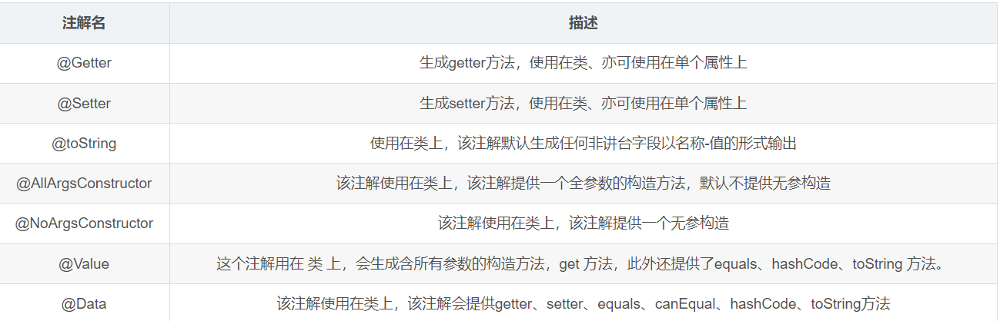

## JUC 前置知识

### IDEA之lombok插件

 版本一定要记住

```java
<dependency>
    <groupId>org.projectlombok</groupId>
    <artifactId>lombok</artifactId>
    <version>1.18.24</version>
    <scope>provided</scope>
</dependency>
```



### juc基础知识：

基础知识补充之-尚硅谷高级技术之JUC高并发编程2021最新版

[尚硅谷高级技术之JUC高并发编程.pdf](assets/atguigu/尚硅谷高级技术之JUC高并发编程2021最新版/尚硅谷高级技术之JUC高并发编程.pdf)

[尚硅谷高级技术之JUC高并发编程.xmind](assets/atguigu/尚硅谷高级技术之JUC高并发编程2021最新版/尚硅谷高级技术之JUC高并发编程.xmind)