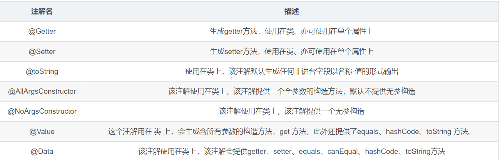

## JUC 前置知识

### IDEA之lombok插件

 版本一定要记住

```java
<dependency>
    <groupId>org.projectlombok</groupId>
    <artifactId>lombok</artifactId>
    <version>1.18.24</version>
    <scope>provided</scope>
</dependency>
```



### juc基础知识：

