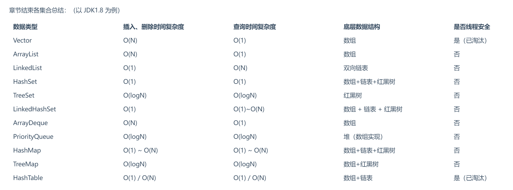
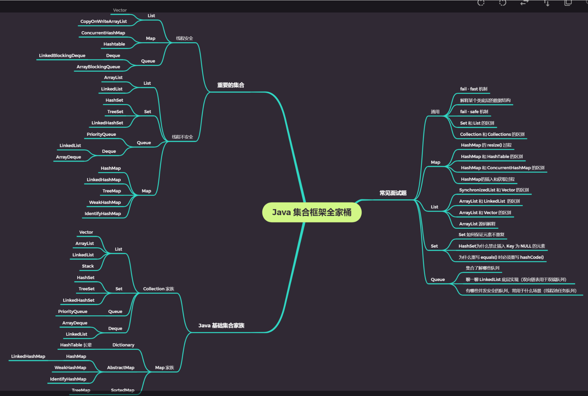

### 1.语法知识之与或非


```java
x& (x-1)得到的结果是x的二进制去掉最低位
m = x & (-x) ，得到的结果是x的二进制中最低位的位置
因为 a ^ a = 0，且 0 ^ b = b
且有交换律 a ^ b = b ^ a
所以 a ^ b ^ a = b
```

### 2.java集合篇

容器：容纳其他Java对象的对象

优点是:

- 降低编程难度
- 提高程序性能
- 提高API间的互操作性
- 降低学习难度
- 降低设计和实现相关API的难度
- 增加程序的重用性

容器主要包括 Collection 和 Map 两种，Collection 存储着对象的集合，而 Map 存储着键值对(两个对象)的映射表。

Java中的容器可以分为两类，Collection和Map。





Java集合详解： <https://blog.csdn.net/m0_37741420/article/details/106884159>

#### Collection

Collection用来存储独立的元素，其中包括List、Set和Queue。

##### List

List是一种线性的列表结构，是一种有序集合，List中的元素可以根据索引进行查找、插入或删除。

###### ArrayList

ArrayList是用数组实现的List，它与数组有很多同样的特点：①随机访问（相对顺序访问）效率高。②读快写慢，由于写操作涉及元素的移动，因此写操作效率低。

ArrayList的父类是AbstractList，该抽象类是大部分List的共同父类，它提供了一些基本的方法封装以及通用的迭代器实现。

ArrayList实现了RandomAcess接口，这是一个标记接口，没有提供任何方法。如果一个类实现了该接口，那么表示这个类使用索引遍历比迭代器更快。

**ArrayList有三个重要的成员变量和两个常量：**

- ```
  transient Object[] elementData;
  ```

  elementData是ArrayList的数据域，transient表示它不会被序列化，但是ArrayList的序列化和反序列化都是可以成功的，这是因为ArrayList实现了Serializable接口的writeObject方法，该方法是private的，当ArrayList对象被序列化时，序列化方法会反射调用该方法来替代默认的序列化方式。

  不使用elementData直接序列化是因为elementData是一个缓存数组，出于性能考虑，它通常会预留一些容量，当容量不足时会扩充容量，因此可能会有大量空间没有存储元素，采用这样的方式可以保证只序列化实际有值的那些元素而不需要序列化整个数组。

- ```
  private int size;
  ```

  size表示当前List的长度，elementData的长度是大于等于size的，因为elementData是缓存数组，size变量标识了真正的List大小。

- ```
  protected transient int modCount = 0;
  ```

  该成员变量继承自AbstractList，记录了ArrayList结构性变化的次数。在ArrayList中所有涉及结构变化的方法都会增加modCount的值，包括add()、remove()、addAll()、removeRange()及clear()。

- ```
  private static final long serialVersionUID = 8683452581122892189L;
  ```

  序列化版本UID，提供给序列化接口使用，该UID是为了维持序列化版本一致的。

- ```
  private static final int MAX_ARRAY_SIZE = Integer.MAX_VALUE - 8;
  ```

  数组长度的上限，Integer的最大值减8。

**ArrayList有三个重载的构造器：**

```
public ArrayList()
public ArrayList(int initialCapacity)
public ArrayList(Collection<? extends E> c) 
```

其中`initialCapacity`表示初始化的elementData的长度，如果使用无参构造器，那么默认长度为10，当构造器的参数为集合时，它会把elementData的长度设置为集合的大小，然后再复制所有集合的元素到elementData。

**ArrayList的一些常用方法：**

- **indexOf/lastIndexOf/contains**

  indexOf方法用于查询指定对象的索引index，实现的方式是对数组顺序遍历，调用指定元素的equals方法来比较，如果查询不到返回-1。

  lastIndexOf与indexOf相反，是对数组倒序遍历。

  contains方法直接调用indexOf方法，根据返回值是否为-1来判断查找的元素是否存在。

- **set/add/addAll**

  set方法的实现很简单，即替换数组里的对应索引处的值。

  add和addAll方法实现相对复杂，首先要检查当前elementData的长度，如果添加后的大小超出了elementData的长度，那么需要对其容量进行修正。

  修正的主要方法是两个：多余和不足。涉及的关键方法是grow(int)，该方法的int参数制定了“本次扩容所允许的最小容量”。grow的逻辑很简单，首先找出当前容量，把新容量设置为旧容量的1.5倍，如果新容量比可用最小容量要小，那么设置新容量为最小容量；如果新容量比极限容量常量要大，那么设置为极限容量常量和最大的整形数的较大值，接着使用该新容量初始化一个新的数组，将原有的elementData中的元素等位复制过去。

- remove/removeAll/retainAll

  remove方法有两种重载形式，当参数为int类型时表示移除位于指定index的数组，如果移除的不是最后一位，会调用System.arraycopy方法把index之后的数据向前移动一位，该方法的返回值指向被删除的元素，效率较低。当参数为Object类型时，表示移除指定的对象，该方法会遍历整个数组找到第一个与之相等的对象，该方法的返回值表示删除是否成功。

  removeAll方法用于移除指定集合里的所有元素，与之相对的retainAll则是保留指定集合里存在的元素，这两个方法调用的都是batchRemove方法，区别是传入的参数一个为false一个为true。

在使用迭代器遍历ArrayList时，不能修改元素，modCount是统计ArrayList修改的次数的，expectedModCount则是在迭代器初始化时记录modCount的值，每次访问新元素时都会调用检查方法检查modCount的值和expectedModCount是否相等，如果发现ArrayList被修改了就会抛出异常。

###### LinkedList

LinkedList的两个主要特性为：顺序访问和写快读慢。

LinkedList的父类是AbstractSequentialList，该抽象类继承自AbstractList，提供了顺序方法存储结构，它提供了get/set/add/addAll/remove等方法的迭代器实现，前提是必须实现Iterator接口。

LinkedList实现了Deque双向队列接口，因为队列的特性是FIFO，因此LinkedList可在尾部增加数组，在头部获取数据，还能操作头尾之间任意节点。

**LinkedList的主要成员变量和常量：**

- ```
  transient int size = 0;
  ```

  用于标记序列的大小，因为链表由单个节点组成，除了统计节点个数以外没有方法获取size，所以提供了标识量来做记录，提高效率。

- ```
  transient Node<E> first;
  ```

  链表的头节点。

- ```
  transient Node<E> last;
  ```

  链表的尾节点，同时提供头尾节点是为了实现Deque双向队列接口要求的功能。

  可以发现所有成员变量都被transient修饰，序列化原理和ArrayList类似。

- ```
  private static final long serialVersionUID = 876323262645176354L;
  ```

  序列化版本UID。

**LinkedList有两个重载的构造器：**

```
public LinkedList()
public LinkedList(Collection<? extends E> c) 
```

与ArrayList不同，链表无需初始化任何对象，所以无参构造器没有做任何操作，带参构造器调用了addAll方法。

**双向队列的实现：**

LinkedList是一个在双向队列基础上搭建的双向链表，双向链表的关键方法有：addFirst队首添加元素、addLast队尾添加元素、removeFirst队首移除元素、removeLast队尾移除元素。这些方法都是操作成员变量first和last来实现的，first和last都是Node类型。

Node的实现很简单：

```
	private static class Node<E> {
		E item;//数据域，存储数据
        Node<E> next;//指向后继节点
        Node<E> prev;//指向前驱节点

        Node(Node<E> prev, E element, Node<E> next) {
            this.item = element;
            this.next = next;
            this.prev = prev;
        }
	}
```

例如addLast方法，新建一个Node节点n，然后将前驱设置为当前的last，将last.next设置为n，即可完成需求，其他方法类似。

**getFirst/getLast/get方法：**

getFirst和getLast这两个方法分别用于取出队首或队尾的数据，直接返回fisrt.item和last.item即可实现。

get方法则不同，LinkedList是顺序存储结构，时间复杂度为O(n)。具体实现时进行了优化，如果index小于size的一半就正序变量，否则倒序遍历。

**set/add/addAll方法：**

与ArrayList不同，LinkedList的add方法比set方法更迅速，add方法的本质是在尾部增加一个节点，根据last指针很快就能实现，而set则需要遍历查找到指定节点并替换，addAll等价于调用多次add。

**removeFirst/removeLast/remove方法：**

removeFirst和removeLast方法用于移除首尾节点并返回数据，remove则是遍历到指定节点然后移除。remove方法的删除操作只需要修改待删除节点后继节点的pre和前驱节点的next指向，而不需要像ArrayList一样移动数据因此删除操作更高效。

###### Vector和Stack

Vector的实现和ArrayList基本一致，底层使用的也是数组，它和ArrayList的区别主要在于：

- Vector是线程安全的，Vector的所有public方法都是用了synchronized修饰。
- Vector多了一个成员变量capacityIncrement，用于标明扩容的增量。

Stack是Vector的子类，它的实现和Vector基本一致，与之相比它多提供了以下方法表达栈的含义：

- E push：入栈，相等于在末尾增加一个元素
- E pop：出栈，移除末尾元素并返回
- E peek：查看栈顶，返回最末尾元素
- empty：用于检查栈是否空
- search：查找元素的栈深度，栈顶元素深度为1，当找不到时返回-1。

- **总结**
  - ArrayList是用数组实现的，数组本身是随机访问的结构。
  - LinkedList是顺序访问结构，在双向队列应用中得到体现。
  - Vector与ArrayList相比是线程安全的，而且容量增长策略不同。
  - Stack是Vector的子类，提供了一些具有栈特性的方法。

##### Set

Set是一个接口，这个接口约定了在其中的数据是不能重复的，主要的实现类有三个：

###### HashSet

HashSet中不允许有重复的元素，HashSet中最多只能有一个null。

HashSet的内部是通过HashMap实现的，HashSet的部分源码：

```
public class HashSet<E> extends AbstractSet<E> implements Set<E>, Cloneable, java.io.Serializable{
    static final long serialVersionUID = -5024744406713321676L;
	
    //底层使用HashMap来实现
    private transient HashMap<E,Object> map;

    //定义一个虚拟的Object对象作为HashMap的value值
    private static final Object PRESENT = new Object();

	//初始化一个空的HashMap，并使用默认初始容量16和加载因子0.75
    public HashSet() {
        map = new HashMap<>();
    }
    
    ...
        
}
```

HashSet的底层是通过HashMap实现的，只是对于HashMap来说每个key有自己对应的value，而在HashSet中之关系key，所以所有的key都使用相同的value即PRESENT。由于PRESENT被定义为静态的，因此会被所有变量共享，节约空间。

HashSet是非线程安全的，如果想使用线程安全的Set，可以使用CopyOnWriteArraySet、Collections.synchronizedSet等。

HashSet不会维护数据插入的顺序，如果想维护插入顺序可以使用LinkedHashSet。

HashSet不会对数据排序，如果想对数据排序可以使用TreeSet。

###### LinkedHashSet

LinkedHashSet是对HashSet的扩展，可以维护数据插入的顺序，内部通过LinkedHashMap实现。

###### TreeSet

有HashSet的所有特性，而且支持排序，默认使用的是数据的自然顺序，可以在创建TreeSet时指定Comparator来对数据进行排序。

底层使用TreeMap来存储数据，将数据有序的功能交给了TreeMap。当使用add方法添加一个元素时，如果新增key是唯一会返回null，如果新增key已经存在了会返回对应的value值。

------

#### Map

Map用来存储key-value键值对，通过键来查找值，其中key是不能重复的。

##### HashMap

- **Java8之前的HashMap**

  在Java8之前，HashMap的底层实现是数组和链表，HashMap的主要成员变量包括：

  ```
  //存储数据的核心成员变量
  transient Entry<K,V>[] table;
  //键值对数量
  transient int size;
  //加载因子，用于决定table的扩容量
  final float loadFactor;
  ```

  table是HashMap和核心成员变量，该数组用于记录HashMap的所有数据，它的每一个下标都对应一条链表，所有哈希冲突的数组都会被存放到同一条链表中，Entry<K,V>则是该链表的节点元素，包含以下成员变量：

  ```
  //存放键值对中的key
  final K key;
  //存放键值对中的value
  V value;
  //指向下一个节点的引用
  Entry<K,V> next;
  //key对应的hashCode
  int hash;
  ```

  HashMap的核心实现是一个单向链表数组，所有方法都是通过操作该数组来完成的，HashMap规定了该数组的两个特性：

  - 在特定的时刻，根据需要来扩容。
  - 长度始终保持为2的幂次方。

  在HashMap中，数据都是以键值对的形式存在的，键值所对应的hashCode将会作为其在数组里的下标，如果两个元素key的hashCode一样，就会被放到同一个下标中的相同链表上，为了使HashMap的查询效率尽可能高，要使键值的hashCode尽可能分散。

  **HashMap的常量：**

  ```
  //默认的初始化容量，必须为2的幂次方
  static final DEFAULT_INITIAL_CAPACITY=16;
  //最大容量，在构造器指定HashMap容量时做比较
  static final int MAXIMUM_CAPACITY=1<<30;
  //默认加载因子，如果没有指定就会使用该常量
  static final DEFAULT_LOAD_FACTOR=0.75f;
  ```

  **put方法：**

  ```
  public V put(K key, V value) {
      if (table == EMPTY_TABLE) {
          inflateTable(threshold);
      }
      if (key == null)//如果关键字为null，就存入table[0]
      	return putForNullKey(value); 
      int hash = hash(key);//关键字不为null，就计算key的hash值
      int i = indexFor(hash, table.length);//根据hash值和table的长度来计算下标
      for (Entry<K,V> e = table[i]; e != null; e = e.next) {//存入table[i]
          Object k;
          //如果key已经存在，就更新其value值然后返回旧的value值
          if (e.hash == hash && ((k = e.key) == key || key.equals(k))) {
              V oldValue = e.value;
              e.value = value;
              e.recordAccess(this);
              return oldValue;
    	     }
      }
      //如果key不存在，将集合修改值加1，然后添加节点
      modCount++;
      addEntry(hash, key, value, i);
      return null;
  }
  ```

  **计算键值的hash方法：**

  ```
  final int hash(Object k) {
      int h = hashSeed;
      if (0 != h && k instanceof String) {
          return sun.misc.Hashing.stringHash32((String) k);
      }
      h ^= k.hashCode();
      h ^= (h >>> 20) ^ (h >>> 12);
      return h ^ (h >>> 7) ^ (h >>> 4);
  }
  ```

  当处理String类型的数据时，直接调用对应方法来获取最终的hash值。

  当处理其他类型数据时，提供一个相对于HashMap事例唯一不变的随机值hashSeed作为计算的初始量。

  执行的异或和无符号右移操作是为了使hash值更加离散，减小哈希冲突。

  **计算元素下标的indexFor方法：**

  ```
  static int indexFor(int h,int length){
  	return h&(length-1);
  }
  ```

  h是目标key的hash值，要根据该值计算下标，和数组的长度-1进行与操作可以保证计算后的index不会超过table的长度范围。

  使用addEntry添加键值对时，如果键值对将要占用的位置不是null，并且size>threshold，那么就会调用扩容方法`resize(2*table.length)`将长度扩大为原来的2倍，扩容之后会重新计算hash值和下标。

  **扩容的resize方法：**

  据新的容量newCapacity来确定新的扩容阈值threshold

  ```
  void resize(int newCapacity) {
      Entry[] oldTable = table;
      int oldCapacity = oldTable.length;
      //如果当前容量已经达到了最大容量，就将阈值设置为Integer的最大值
      if (oldCapacity == MAXIMUM_CAPACITY) {
          //当阈值被设置为Integer最大值后，扩容就不会再触发
          threshold = Integer.MAX_VALUE;
          return;
      }
      //否则用新计算的容量×加载因子，和最大容量+1进行比较，取较小值作为新的扩容阈值
      Entry[] newTable = new Entry[newCapacity];
      //使用transfer方法重写计算当前节点转移到新数组后的下标
      transfer(newTable, initHashSeedAsNeeded(newCapacity));
      table = newTable;
      threshold = (int)Math.min(newCapacity * loadFactor, MAXIMUM_CAPACITY + 1);
  }
  ```

  **重新计算下标的transfer方法：**

  ```
  void transfer(Entry[] newTable, boolean rehash) {
      int newCapacity = newTable.length;
      //遍历所有键值对，根据键的hash值和新的数组长度重新确定下标
      for (Entry<K,V> e : table) {
          while(null != e) {
              Entry<K,V> next = e.next;
              //判断是否需要哈希重构，如果key值不为null则重写计算hash值
              if (rehash) {
                  e.hash = null == e.key ? 0 : hash(e.key);
              }
              int i = indexFor(e.hash, newCapacity);
              e.next = newTable[i];
              newTable[i] = e;
              e = next;
          }
      }
  }
  ```

  **get方法：**

  ```
  public V get(Object key) {
      	//key为null就返回table[0]的数据
          if (key == null)
              return getForNullKey();
      	//根据key值找到对应节点，找到就返回value，否则返回null
          Entry<K,V> entry = getEntry(key);
          return null == entry ? null : entry.getValue();
  }
  
  //key为null的get方法
  private V getForNullKey() {
      if (size == 0) {//size为0代表链表为空，返回null
          return null;
      }
      //遍历table[0]的链表，如果key为null返回对应value值
      for (Entry<K,V> e = table[0]; e != null; e = e.next) {
          if (e.key == null)
              return e.value;
      }
      //没有找到，返回null
      return null;
  }
  
  //根据key的hash值获取value的get方法
  final Entry<K,V> getEntry(Object key) {
      if (size == 0) //size为0表示链表为空，返回null
          return null;
      //key不为null提供hash方法计算hash值，否则hash值为0
  	int hash = (key == null) ? 0 : hash(key);
      //遍历该下标下链表的所有节点
  	for (Entry<K,V> e = table[indexFor(hash, table.length)];e != null;e = e.next){
      	Object k;
          //如果hash值和key值都相同，找到了对应元素，返回其value值
      	if (e.hash==hash&&((k=e.key)== key||(key != null && key.equals(k))))
          return e;
  	}
  	return null;//没有找到就返回null值
  }
  ```

  **性能优化：**

  HashMap执行写操作（put）时，比较消耗资源的是遍历链表，扩容数组；HashMap执行读操作（get）时，比较消耗资源的是遍历链表。

  影响遍历链表的因素是链表的长度，在HashMap中，链表的长度由哈希冲突的频率决定。哈希冲突的频率又受数组长度决定，长度越长则冲突概率越小，但同时闲置的内存空间也越多。所以需要在时间和空间取得一个平衡点。哈希冲突的概率也受key的hash值影响，所以计算的hash值越离散，冲突概率越低。链表遍历中需要调用key值得equals方法，不合理的equals方法会导致HashMap效率低下甚至异常。

  因此提高HashMap的效率可以从以下方面入手：

  - 根据业务需求测试出合理的加载因子，否则使用默认的0.75。
  - 合理重写键值对象的equals方法和hashCode方法。

- **Java8之后的HashMap**

  Java8的HashMap数据结构发生了较大的变化，之前的HashMap使用的是数组+链表的形式，新的HashMap使用的是数组+链表/红黑树的形式，虽然使用的依旧是table数组，但数据类型发生了变化，代表节点的Entry换成了Node：

  ```
  static class Node<K,V> implements Map.Entry<K,V> {
  	final int hash;//hash值
  	final K key;//key值
  	V value;//value值
  	Node<K,V> next;//下一个Node节点的引用
  	...
  }
  ```

  **put方法：**

  ```
  //调用putvalue方法
  public V put(K key, V value) {
      //通过hash方法计算出key的hash值，作为参数传递
  	return putVal(hash(key), key, value, false, true);
  }
  
  //根据key的hash值存放元素
  final V putVal(int hash, K key, V value, boolean onlyIfAbsent,boolean evict) {
      Node<K,V>[] tab; 
      Node<K,V> p; 
      int n, i;
      //如果table为空或没有元素时就进行扩容
      if ((tab = table) == null || (n = tab.length) == 0)
          n = (tab = resize()).length;
      //元素下标位置依旧通过hash和数组长度-1进行与操作得出，如果不存在就新创建一个节点
      if ((p = tab[i = (n - 1) & hash]) == null)
          tab[i] = newNode(hash, key, value, null);
      else {
          Node<K,V> e; K k;
          //如果首节点和待插入元素得hash值和key值都一样，记录下来
          if (p.hash==hash&&((k = p.key) == key || (key != null && key.equals(k))))
              e = p;
          //如果首节点是红黑树类型，使用putTreeVal方法增加一个树节点
          else if (p instanceof TreeNode)
              //每一次都比较插入节点和当前节点的大小，待插入节点小就往左子树查找，否则往右子树查找，找到空位后执行两个方法：1 balanceInsert方法，平衡插入，一方面把节点插入红黑树，一方面对红黑树进行调整使之平衡。2 moveRootToFront，由于红黑树调整平衡后root节点可能变化，table里记录的节点不再是根节点，需要重置。
              e = ((TreeNode<K,V>)p).putTreeVal(this, tab, hash, key, value);
          else {
              //如果是链表节点，就遍历链表，根据hash值和key判断是否重复，决定是更新值还是新增节点
              for (int binCount = 0; ; ++binCount) {
                  //遍历到了链表末尾，添加链表元素
                  if ((e = p.next) == null) {
                      p.next = newNode(hash, key, value, null);
                      //如果达到了建树阈值，把链表重构位红黑树
                      if (binCount >= TREEIFY_THRESHOLD - 1) 
                          treeifyBin(tab, hash);
                      break;
                  }
                  //找到了和待插入元素相同key值的元素，记录下类并退出
                  if (e.hash == hash &&
                      ((k = e.key) == key || (key != null && key.equals(k))))
                      break;
                  p = e;
              }
          }
          //说明待插入元素已在HashMap中，更新其value值就可以
          if (e != null) { 
              V oldValue = e.value;
              if (!onlyIfAbsent || oldValue == null)
                  e.value = value;
              afterNodeAccess(e);
              return oldValue;
          }
      }
      ++modCount;//修改次数增加1
      //如果节点数+1大于阈值，就要进行扩容
      if (++size > threshold)
          resize();
      afterNodeInsertion(evict);
      return null;
  }
  ```

  **计算hash值的方法：**

  Java8也进行了哈希分散，但是计算过程简单了许多，如果key非空就将key的hashCode值的高低16位进行异或操作，这主要是为了让尽可能多的位参与运算，让结果中的0和1分布得更加均匀，从而降低哈希冲突的概率。

  ```
  static final int hash(Object key) {
  	int h;
  	return (key == null) ? 0 : (h = key.hashCode()) ^ (h >>> 16);
  }
  ```

  **resize方法：**

  重新规划长度和阈值，如果长度发生了变化，部分数据节点也要重新排列。

  - **重新规划长度**

    如果size超出扩容阈值，进行扩容，把table的容量增加为之前的2倍。

    如果新的table容量小于默认的初始化容量16，那么将table容量重置为16。

    如果新的table容量大于等于最大容量，那么将阈值设为Integer的最大值，并且return终止resize过程，由于size不可能超过Integer最大值因此之后不会再发生扩容。

  - **重新排列数据节点**

    如果节点为null，则不进行处理。

    如果节点不为null且没有next节点，那么重新计算其hash值然后存入新的table中。

    如果节点为树节点，那么调用树节点的split方法进行处理，该方法用于对红黑树调整，如果太小会退化回链表。

    如果节点是链表节点，需要将链表拆分为hashCode超出旧容量的链表和未超出容量的链表。对于 `hash&oldCap==0`的部分不需要做处理，反之需要放到新的下标位置上，新下标=旧下标+旧容量。

##### LinkedHashMap

- **Java8之前的LinkedHashMap**

  存储结构是数组+链表，并维护了一个环形链表来实现有序访问的目的，该链表的表头header既是头又是尾，但它本身只是一个标记，不包含数据域。

  LinkedHashMap中的createEntry方法除了创建Hash桶中的链表节点，还需要把该链表的引用插入环形链表中。

- **Java8之后的LinkedHashMap**

  有3个关键的成员变量：

  ```
  //双向链表的表头，最旧的节点
  transient LinkedHashMap.Entry<K,V> head;
  //双向链表的表尾，最新的节点
  transient LinkedHashMap.Entry<K,V> tail;
  //迭代顺序，true表示顺序，false表示逆序
  final boolean accessOrder;
  ```

  存储结构是数组+链表/红黑树，并维护了一个双向链表实现有序访问。

  newNode方法和newTreeNode方法继承自HashMap，LinkedHashMap重写了这两个方法，负责在创建节点的同时将其插入双向链表，实现了保存数据节点副本到双向链表的功能。

- **TreeMap**

  TreeMap是完全由红黑树实现的。

  **有四个构造器：**

  ```
   //无参构造器，初始化比较器为null
   public TreeMap()
   //使用外部传入的比较器作为TreeMap的比较器
   public TreeMap(Comparator<? super K> comparator)
   //使用外部传入的Map初始化TreeMap
   public TreeMap(Map<? extends K, ? extends V> m)
   //使用外部传入的SortedMap初始化TreeMap，并且用其比较器初始化TreeMap比较器
   public TreeMap(SortedMap<K, ? extends V> m)
  ```

  **put方法原理：**

  - 如果TreeMap为空，那么使用指定数据作为根节点。
  - TreeMap非空，使用比较器来决定插入位置，如果比较器为空，那么默认key实现了Comparable接口，调用其compareTo方法来决定插入位置，如果没有实现该接口会抛出类型转换异常。
  - 插入完成后调整红黑树的平衡。

- **HashTable**

  HashTable的实现和HashMap很类似，方法被synchronized修饰，是线程安全的，但是效率很低。此外，HashTable中不能存放键值为null的元素。

- **补充：红黑树**

  红黑树是一种自平衡的二叉查找树。

  - **特性**

    - 红黑树的每个节点只能是红色或者黑色。
    - 根节点是黑色的。
    - 每个叶子节点都是黑色的。
    - 如果一个叶子节点是红色的，它的子结点必须是黑色的。
    - 从一个节点到该节点的叶子节点的所有路径都包含相同数目的黑色节点。

  - **左旋和右旋**

    - **左旋：**对a节点进行左旋，指将a节点的右节点作为a的父节点，即将a变成一个左节点，因此左旋意味着被旋转的节点变成一个左节点。
    - **右旋：**对a节点进行右旋，指将a节点的左节点作为a的父节点，即将a变成一个右节点，因此右旋意味着被旋转的节点变成一个右节点。

  - **添加**

    红黑树的添加分为3步：①将红黑树看作一颗二叉查找树，并以二叉树的插入规则插入新节点。②将插入的节点设为红色或黑色。③通过左旋、右旋或变色，使之重新成为一棵红黑树。

    根据被插入节点的父节点情况，可以将插入分为3种情况处理：

    - 被插入的节点是根节点，直接将其涂为黑色。
    - 被插入节点的父节点是黑色的，不做处理，节点插入后仍是红黑树。
    - 被插入节点的父节点是红色的，一定存在非空祖父节点，进一步分为三种情况处理：
      - 叔叔节点是红色的，将父节点设为黑色，叔叔节点设为黑色，祖父节点设为红色，将祖父节点作为当前节点。
      - 叔叔节点是黑色的且当前节点是右节点，则将父节点设为当前节点，以新节点为支点左旋。
      - 叔叔节点是黑色的且当前节点是左节点，则将父节点设为黑色，祖父节点设为红色，以祖父节点为支点右旋。

  - **删除**

    红黑树的添加分为3步：①将红黑树看作一颗二叉查找树，并以二叉树的删除规则删除新节点。②通过左旋、右旋或变色，使之重新成为一棵红黑树。

    根据被删除节点的情况，可以将删除分为3种情况处理：

    - 被删除的节点没有子节点，直接将其删除。
    - 被删除节点只有一个子节点，直接删除该节点，并用其唯一子节点替换其位置。
    - 被插入节点有两个子节点，先找出该节点的替换节点，然后把替换节点的数值复制给该节点，删除替换节点。

    通过左旋、右旋或变色使其重新成为红黑树。如果当前节点的子节点是一红一黑，直接将该节点设为黑色。如果当前节点的子结点都是黑色，且当前节点是根节点，则不做处理。如果当前节点的子节点都是黑色且当前节点不是根节点，分为以下几种情况：

    - 当前节点的兄弟节点是红色的，就将当前节点的兄弟节点设为黑色，将父节点设为红色，对父节点左旋，重新设置当前节点的兄弟节点。
    - 当前节点的兄弟节点是黑色的，兄弟节点的两个子节点也都是黑色的，则将当前节点的兄弟节点设为红色，将当前节点的父节点作为新节点。
    - 当前节点的兄弟节点是黑色的，兄弟节点的左节点是红色右节点是黑色，将当前节点的左子结点设为黑色，将兄弟节点设为红色，对兄弟节点右旋、重新设置兄弟节点。
    - 当前节点的兄弟节点是黑色的，兄弟节点的右节点是红色的，将当前节点的父节点赋给兄弟节点，将父节点设为黑色，将兄弟节点的右子节点设为黑色，对父节点左旋，设置当前节点为根节点。

### 3.java小数

**一、小数转换成单精度二进制**

以32位单精度为例：

小数=-36.35

**第一步：符号位，负用1表示，正的用0，所以[1个符号位] 是1**

**第二步：整数直接转换成二进制**

> 　　十进制36 = 二进制0010 0100

**第三步：将小数转换成二进制**

> 　　十进制0.35 = 二进制**0101 1001** 1001 1001 10001 1001 其中1001循环
>
> ​       计算过程：  0.35 x 2 = 0.7取整得**0** 取上次结果的小数部分乘以2
>
> ​                          0.7 x 2 = 1.4取整得**1**  取0.7的小数部分即0.7乘以2
>
> ​                          0.4 x 2 = 0.8取整得**0**  取1.4的小数部分即0.4乘以2
>
> ​                          0.8 x 2 = 1.6取整得**1**  取1.6的小数部分0.6乘以2
>
> ​                          0.6 x 2 = 1.2取整得**1**  取上次结果的小数部分乘以2
>
> ​                          0.2 x 2 = 0.4取整得**0**
>
> ​                          0.4 x 2 = 0.8取整得**0**
>
> ​                                   **...循环**

 **第三步：移动小数点计算阶码**

> 　整数二进制.小数二进制
>
> 　=0010 0100.**0101** **1001** 1001 1001 10001 1001
>
> 　移动小数点，使二进制变成**1**.xxx***2**n形式（规格化）
>
> 　=001.0 0100 0101 1001 1001 1001 10001 1001*25
>
>    去掉1.xxx前面的0
>
>    =1.**0 0100 0101 1001 1001 1001 10001 1001***25
>
>   指数的真值是5加上(8位阶码位移码偏移量**127**)=132
>
>   5 + 127 = 132
>
>  132的二进制是1000 0100 所以**[8个阶码位]是1000 0100**

**第四步：取1.xxx形式小数点后23位得到[23个尾数位]=0 0100 0101 1001 1001 1001 10001 1001 .. （取23位）**

**第五步：组合二进制**

> 　　32位单精度二进制 = [1个符号位] [8个阶码位] [23个尾数位]
>
> 　　　　　　　　　　 = [1] [1000 0100] [0 0100 0101 1001 1001 1001 10001 1001 .. （取23位）]
>
> 　　　　　　　　　　 **=** 1 **1000 0100 0 0100 0101 1001 1001 1001 10001 1001 .. （取23位）**

  双精度同理

**二、二进制转单精度小数**

以0011 1001 0010 1011 1110 1000 000 0000为例

**第一步：分三段**

> 　　**0  0111 0010** 010 1011 1110 1000 0000 0000
>
> 　　[1个符号位] [8个阶码位] [23个尾数位]
>
> ​       0表示正数

**第二步：计算指数**

> 　　0111 0010阶码=十进制114，减去8位阶码位移码偏移量**127**
>
> 　　114 - 127 = -13
>
> 　　在23位尾数前加1.变成 **1.**[23个尾数]，然后向左移动13位（**负数向左，正数向右**）-- 和坐标轴方法一样
>
> ​       1.010 1011 1110 1000 0000 0000向左移动13位后等于0.0000 0000 0000 0 **1**010 1011 1110 1000 0000 0000

**第三步：计算小数**

> 　　转换成小数=2-14 + 2-16 + 2-18 + 2-20 + 2-21 + 2-22 + 2-23 + 2-24 + 2-26
>
> ​                         =0.00008197128772735595703125