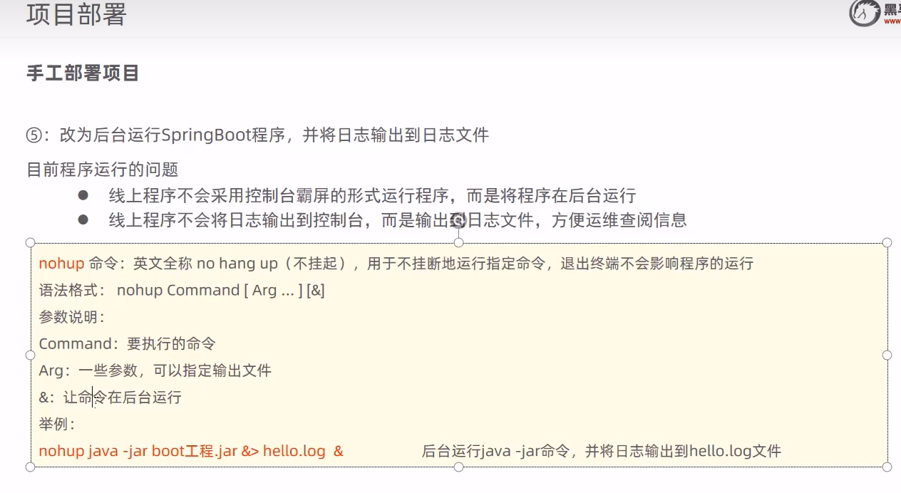
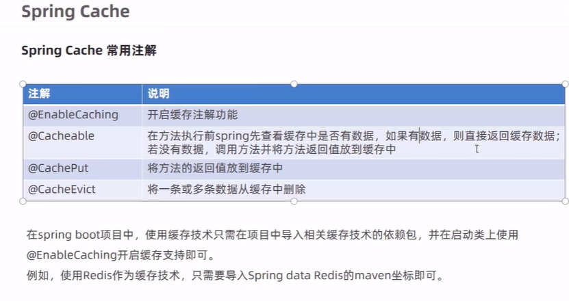

## 1.SpringBoot学习

1.尚硅谷】SpringBoot2零基础入门教程（spring boot2干货满满）

视频地址：https://www.bilibili.com/video/BV19K4y1L7MT/

官方笔记连接：https://www.yuque.com/atguigu/springboot

整理版本：[springBoot2上](./assets/atguigu/SpringBoot2/1.md)               [springBoot2下](./assets/atguigu/SpringBoot2/2.md)

2.手工部署项目

linux 后台 ps -ef |grep ‘java -jar’   然后kill -9 +进程号

3spring Cache

