## 1.SpringBoot学习

### 1.1 [尚硅谷]SpringBoot2零基础入门教程（spring boot2干货满满）

视频地址：https://www.bilibili.com/video/BV19K4y1L7MT/

官方笔记连接：https://www.yuque.com/atguigu/springboot

整理版本：[springBoot2上](./assets/atguigu/SpringBoot2/1.md)               [springBoot2下](./assets/atguigu/SpringBoot2/2.md)

### 1.2 手工部署项目


linux 后台 ps -ef |grep ‘java -jar’   然后kill -9 +进程号

### 1.3 spring Cache


### 1.4 mysql主从复制

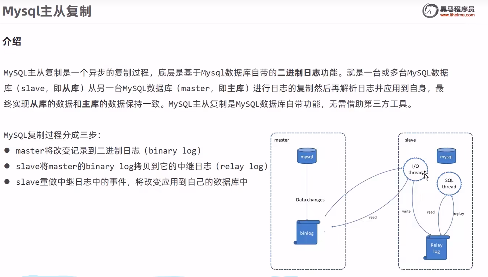

配置主从复制

```shell
#第一步修改mysql数据库的配置文件/ect/my.cnf

[mysqld]
log-bin=mysql-bin #[必须]启用二进制日志
server-id=100 #[必须]服务器唯一ID 100 随便改


#第二步 重启mysql服务
systemctl restart mysqld

#第三步 执行以下语句
# 查看mysql 密码规则
SHOW VARIABLES LIKE 'validate_password%';
#设置密码最低长度
set global validate_password.length=4;
#设置密码等级
set global validate_password.policy=0;
#创建用户
create user 'webb'@'%' identified with mysql_native_password by 'webb19990525';

#查看密码加密 方式
select host,user,plugin,authentication_string from user;

# 授权replication slave 给用户
grant replication slave on *.* to 'webb'@'%';

# 回收授权
REVOKE replication slave on *.* from 'webb'@'%';

# 删除用户
DROP user 'webb'@'%';

# 查询用户repl授权情况
show GRANTS FOR 'webb'@'%';

# 刷新权限
FLUSH PRIVILEGES;

#注:上面SOL的作用是创建一个用户webb,密码为webb1990525，并且给webb用户授予REPLICATION SLAVE权限。常用于建立复制时所需要用到的用户权限，也就是slave必须被master授权具有该权限的用户，才能通过该用户复制。

#第四步 登录mysql数据库 执行以下sql 记录结果中的file和position值
show master status;

#修改从库slave 
server-id=101 #[必须]服务器唯一ID 101 随便改

#重启mysql服务
systemctl restart mysqld

#从库执行 以下操作
change master to master_host='1.12.224.96',master_user='webb',master_password='webb19990525',master_log_file='mysql-bin.000002',master_log_pos=8400;

start slave; #若之前启动过 需关闭后重新启动\

#查看是否配置成功 登录从库
show slave status;
#查看slave—io-running 和slave-sql-running 是否为yes
```

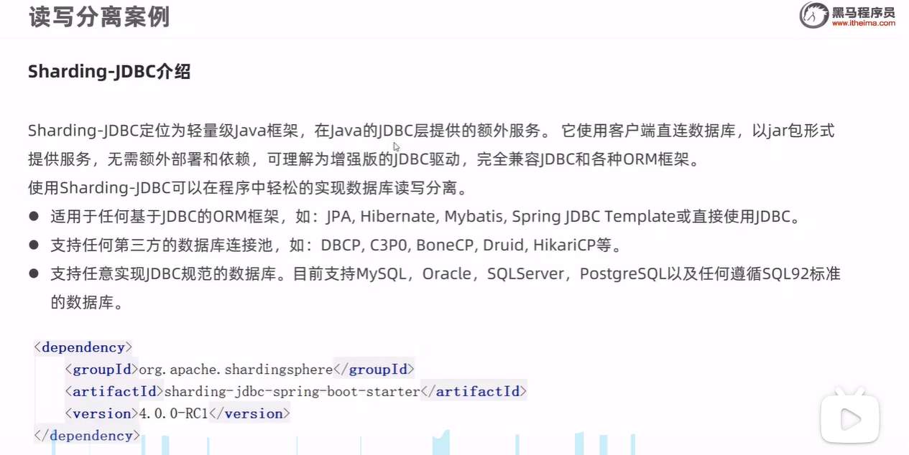

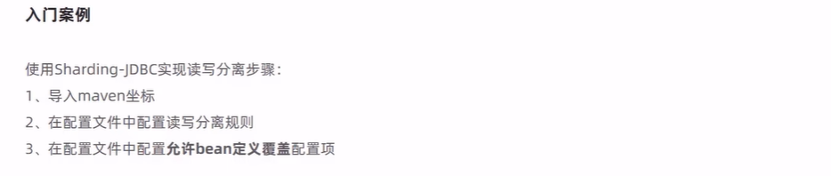

```xml
 <!--  读写分离-->
        <dependency>
            <groupId>org.apache.shardingsphere</groupId>
            <artifactId>sharding-jdbc-spring-boot-starter</artifactId>
            <version>4.0.0-RC1</version>
        </dependency>
 
spring:
  shardingsphere:
    datasource:
      names:
        master,slave
      # 主数据源
      master:
        type: com.alibaba.druid.pool.DruidDataSource
        driver-class-name: com.mysql.cj.jdbc.Driver
        url: jdbc:mysql://192.168.138.100:3306/rw?characterEncoding=utf-8
        username: root
        password: root
      # 从数据源
      slave:
        type: com.alibaba.druid.pool.DruidDataSource
        driver-class-name: com.mysql.cj.jdbc.Driver
        url: jdbc:mysql://192.168.138.101:3306/rw?characterEncoding=utf-8
        username: root
        password: root
    masterslave:
      # 读写分离配置
      load-balance-algorithm-type: round_robin #轮询
      # 最终的数据源名称
      name: dataSource
      # 主库数据源名称
      master-data-source-name: master
      # 从库数据源名称列表，多个逗号分隔
      slave-data-source-names: slave
    props:
      sql:
        show: true #开启SQL显示，默认false
  main:
    allow-bean-definition-overriding: true
```

### 1.5 nginx下载和安装

```shell
#1、安装依赖包 
yum -y install gcc pcre-devel zlib-devel openssl openssl-devel
#2、下载Nginx安装包
wget https://nginx.org/download/nginx-1.24.0.tar.gz
#3、解压 
tar -zxvf nginx-1.24.0.tar.gz
cd nginx-1.24.0.tar.gz
./configure --prefix=/usr/local/nginx
make && make install

#nginx 常用命令 进行 nginx 安装目录下的sbin 文件
./nginx -v #查看版本
./nginx -t #查看配置文件正确性
./nginx #启动nginx 
./nginx -s stop #停止nginx 
./nginx -s reload #重新加载nginx配置文件
ps -ef|grep nginx #查看nginx 进程
vim /etc/profile #将/usr/local/nginx/sbin 添加到全局环境变量中
```

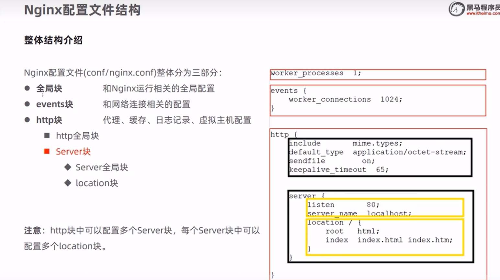

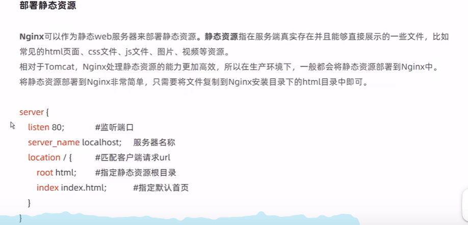

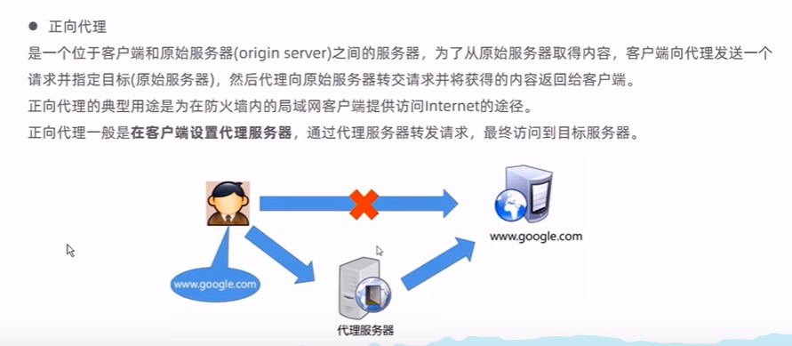

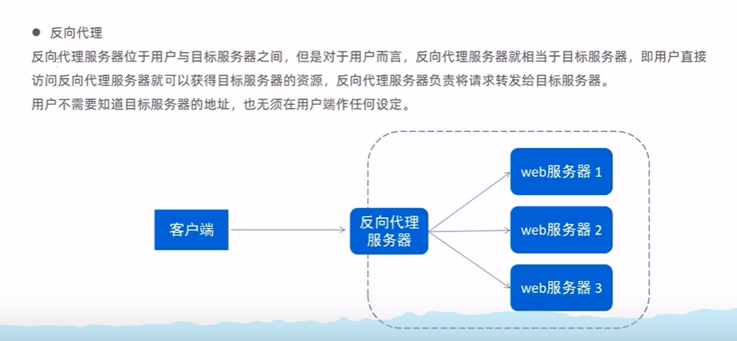

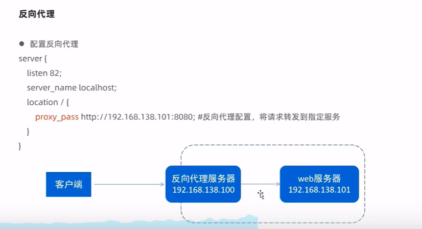

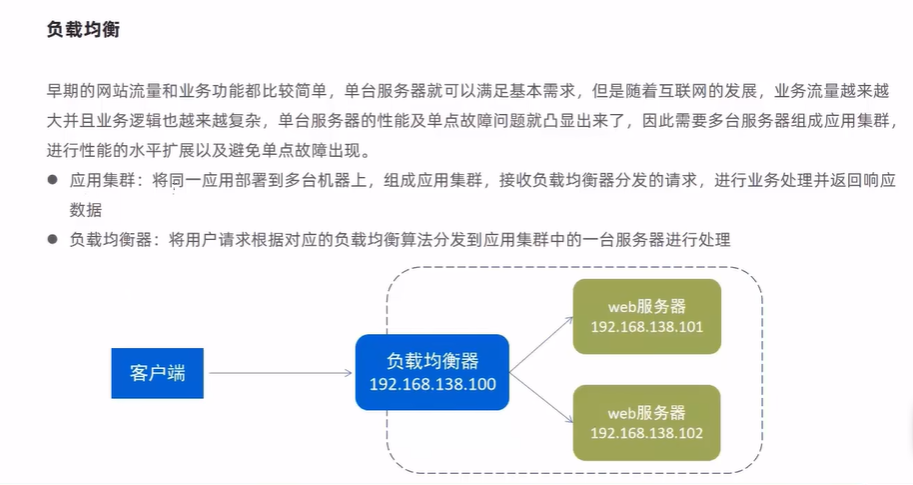

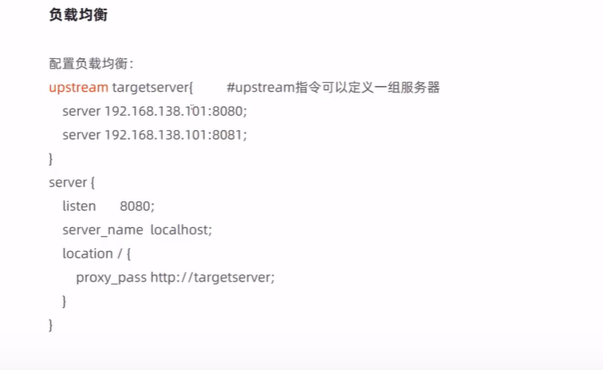

上述 8080 后面可改参数 

例如：权重越大 访问次数越大

server 192.168.138.101:8080 weight=10

server 192.168.138.101:8080 weight=5

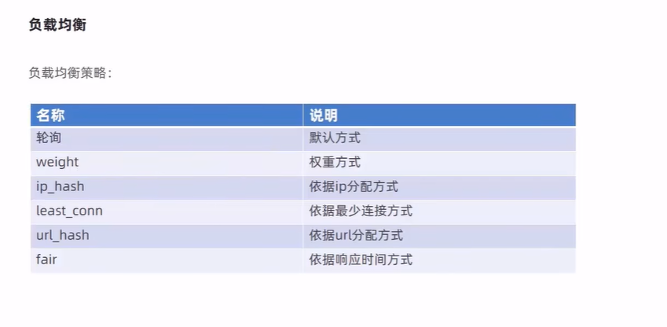

### 1.6 前后端分离

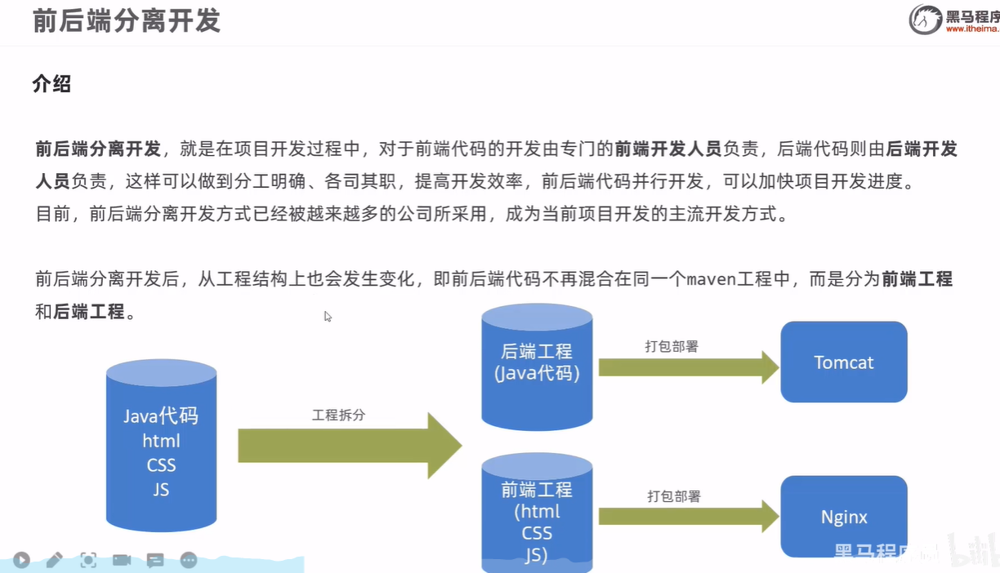

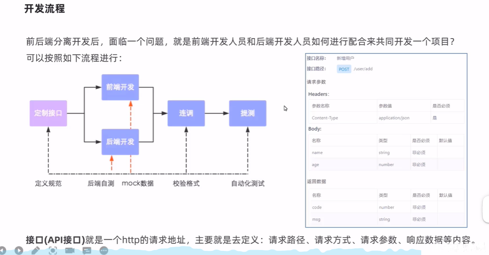

### 1.7 一些工具及部署

yAPI  https://github.com/YMFE/yapi 前后端分离接口定义

swagger 官网 https://swagger.io/

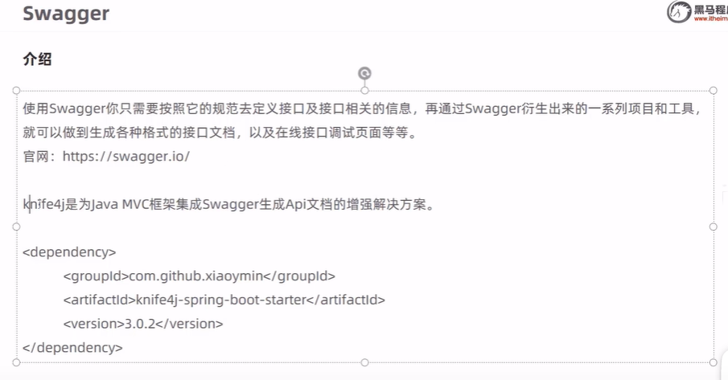

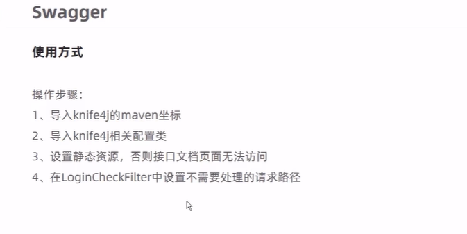

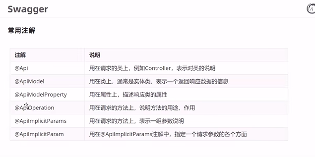

项目部署 以瑞吉外卖为介绍

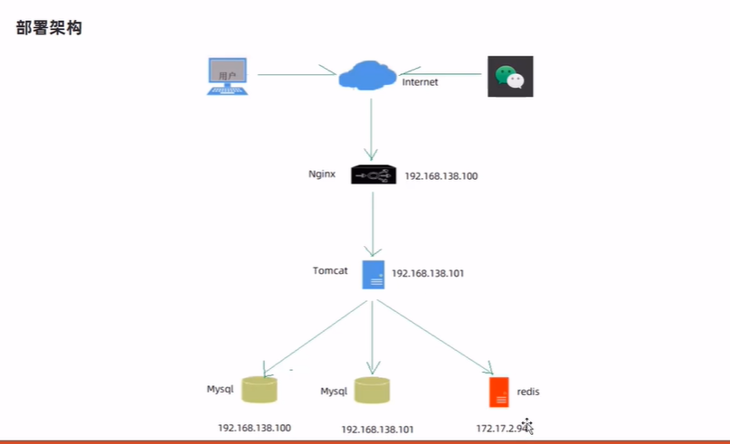

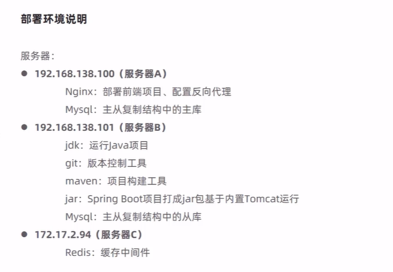

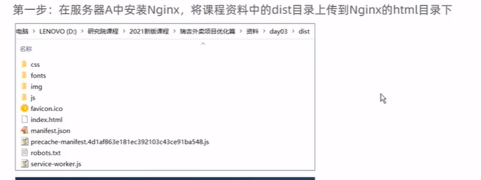

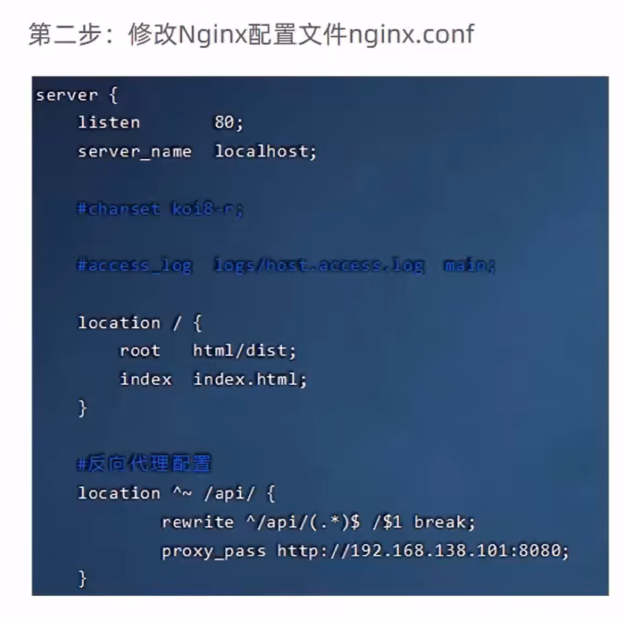

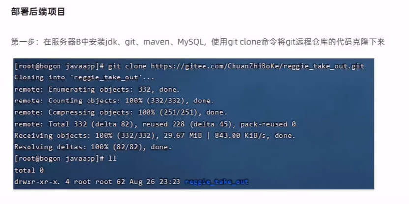

```shell
#自动化部署脚本
#!/bin/sh
echo =================================
echo  自动化部署脚本启动
echo =================================

echo 停止原来运行中的工程
APP_NAME=reggie_take_out

tpid=`ps -ef|grep $APP_NAME|grep -v grep|grep -v kill|awk '{print $2}'`
if [ ${tpid} ]; then
    echo 'Stop Process...'
    kill -15 $tpid
fi
sleep 2
tpid=`ps -ef|grep $APP_NAME|grep -v grep|grep -v kill|awk '{print $2}'`
if [ ${tpid} ]; then
    echo 'Kill Process!'
    kill -9 $tpid
else
    echo 'Stop Success!'
fi

echo 准备从Git仓库拉取最新代码
cd /usr/local/javaapp/reggie_take_out

echo 开始从Git仓库拉取最新代码
git pull
echo 代码拉取完成

echo 开始打包
output=`mvn clean package -Dmaven.test.skip=true`

cd target

echo 启动项目
nohup java -jar reggie_take_out-1.0-SNAPSHOT.jar &> reggie_take_out.log &
echo 项目启动完成

```

