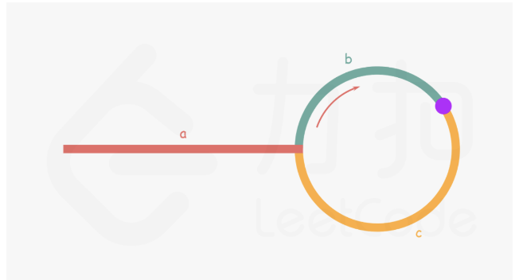

## 面试题

### 1.百度-排序数目

小红拿到了一个排列，她想知道有多少区间满足，区间内部的数构成一个排列?    

排列的定义:1到k，每个数都出现过且恰好出现一次，被称为一个长度为k的排列。例如[2,1,3][4,3,2,1]都是排列。

输入描述:有多组数据，首先输入一个正整数T，表示有T组数据 (1<=T<=2)每组数据的第一行输入一个正整数n，代表排列的大小 (1<=n<=2*10e5)每组数据的第二行输入n个正整数。

```java
输入示例
2
5
1 2 3 4 5
5
2 1 5 3 4
输出示例
5
3
说明
第一章数据，[1],[1,2],[1,2,3],[1,2,3,4].[1,2,3,4,5]共5个排列。
第二组数据，[2,1][1],[2,1,5,3,4]共3个排列
```

思路：找出1的下标 然后往后遍历 找到2,3,4......的下标 依次记录最小下标值和最大下标值 计算长度 是否等于 当前最大数和最小数

```java
public static void main(String[] args) {
    Scanner input=new Scanner(System.in);
    int T=input.nextInt();
    int res[]=new int[T];
    for (int i = 0; i <T; i++) {
        int ans=1;
        int n=input.nextInt();
        //记录要输入的数字
        int numbers[]=new int[n];
        //记录这些数字的下标值 index[1] 记录的为 numbers值为1的下标
        int index[]=new int[n+1];
        for (int j = 0; j < n; j++) {
            numbers[j]=input.nextInt();
            index[numbers[j]]=j;
        }
        int left=index[1],right=index[1];
        // 依次往后找2，3，4.。。不断更新最小下标和最大下标 有相同的就加加
        for (int j = 2; j <= n; j++) {
            left=Math.min(left,index[j]);
            right=Math.max(right,index[j]);
            if(right-left==j-1){
                ans++;
            }
        }
        res[i]=ans;
    }
    for (int i = 0; i < res.length; i++) {
        System.out.println(res[i]);
    }
}
```

## 思路类题

### 力扣581. 最短无序连续子数组

给你一个整数数组 `nums` ，你需要找出一个 **连续子数组** ，如果对这个子数组进行升序排序，那么整个数组都会变为升序排序。请你找出符合题意的 **最短** 子数组，并输出它的长度。

```
输入：nums = [2,6,4,8,10,9,15]
输出：5
解释：你只需要对 [6, 4, 8, 10, 9] 进行升序排序，那么整个表都会变为升序排序。
```

思路：数组分为三个部分 numsA numsB numsC 其中numsA中最大元素小于 numsB和C numsC中最小元素大于numsA和B 从左往右找最大元素，若当前元素大于最大之前最大元素则更新 最大元素，若小于则更新下标（当前元素为不满足numsC的定义(numsC有序），可能为numsB的右边界）遍历完及找到numsB左边界 同理找最小及为左边界

```java
class Solution {
    public int findUnsortedSubarray(int[] nums) {
        int n = nums.length;
        int maxn = Integer.MIN_VALUE, right = -1;
        int minn = Integer.MAX_VALUE, left = -1;
        for (int i = 0; i < n; i++) {
            if (maxn > nums[i]) { //maxn:表示前一项;nums[i]:表示当前项
                right = i;//可理解为:前一项比当前项大时,该数组不为升序数组,并记录当前项.  遍历一次后,right即为最后一个使之不为升序数组的数.  left同理
            } else {
                maxn = nums[i];
            }
            if (minn < nums[n - i - 1]) {
                left = n - i - 1;
            } else {
                minn = nums[n - i - 1];
            }
        }
        return right == -1 ? 0 : right - left + 1;
    }
}
```

## 链表

### 环形链表求环入口

链表是否有环：

（1）如果链表无环，则快慢指针不会相遇，快指针一定会走到链表的尾部，也就是next指针为null的地方。

（2）如果链表有环，则快慢指针一定会相遇，证明如下：

          当快慢指针都位于环内时，环是不存在先后之分的，我们可以将快慢指针的相遇，当成快指针追赶慢指针的过程，然后用数据归纳法分情况讨论：
    *1）如果快指针位于慢指针后面1位，则下一次走时，慢指针往前走1位，快指针往前走2位，快慢指针相遇。
    *2）如果快指针位于慢指针后面2位，则下一次走时，慢指针往前走1位，快指针往前走2位，变成*1）的情况。
    *3）如果快指针位于慢指针后面n位，则下一次走时，慢指针往前走1位，快指针往前走2位，快指针位于慢指针后面n-1位。
    也就是说，n次后，快慢指针终究会相遇。因为是在环里，快慢指针的距离，一定是小于环的大小的。所以慢指针不用走1圈，就能和快指针相遇。

寻找环的入口：



 如上图所示：

    a :  从链表头节点到链表环入口的距离
    b：从链表环入口顺时针到快慢指针第一次相遇的距离
    c： 从快慢指针第一次相遇的位置，顺时针到链表入环点的距离

第一次相遇时，设快指针此时绕环走了N圈，快指针走过的距离是慢指针的2倍：

```
// 快指针走的距离是慢指针的2倍
2(a + b) = a + N * ( b + c ) + b
//上式可以转化为
a = ( N - 1 ) * ( b + c ) + c

a = ( N - 1 ) * ( b + c ) + c，可以理解为：从相遇点到入环点的距离，加上(N-1)圈的环长，刚好等于从链表头部到入环点的距离。
因此，当快慢指针相遇时，我们将快指针指向链表头部，并且改为和慢指针一样，每次走一步，最终它们会在入环扣相遇。
```

```java
public class Solution {
    public ListNode detectCycle(ListNode head) {
        if(head==null){
            return null;
        }
        ListNode firstNode=head;
        ListNode secondNode=head;
        do{
            if(secondNode.next==null||secondNode.next.next==null){
                return null;
            }
            secondNode=secondNode.next.next;
            firstNode=firstNode.next;
        }while(firstNode!=secondNode);
        secondNode=head;
        while(firstNode!=secondNode){
            secondNode=secondNode.next;
            firstNode=firstNode.next;
        }
        return firstNode;
    }
}
```


## 动态规划

### 力扣 426 目标和

给你一个整数数组 `nums` 和一个整数 `target` 。

向数组中的每个整数前添加 `'+'` 或 `'-'` ，然后串联起所有整数，可以构造一个 **表达式** ：

- 例如，`nums = [2, 1]` ，可以在 `2` 之前添加 `'+'` ，在 `1` 之前添加 `'-'` ，然后串联起来得到表达式 `"+2-1"` 。

返回可以通过上述方法构造的、运算结果等于 `target` 的不同 **表达式** 的数目。

```
输入：nums = [1,1,1,1,1], target = 3
输出：5
解释：一共有 5 种方法让最终目标和为 3 。
-1 + 1 + 1 + 1 + 1 = 3
+1 - 1 + 1 + 1 + 1 = 3
+1 + 1 - 1 + 1 + 1 = 3
+1 + 1 + 1 - 1 + 1 = 3
+1 + 1 + 1 + 1 - 1 = 3

1 <= nums.length <= 20
0 <= nums[i] <= 1000
0 <= sum(nums[i]) <= 1000
-1000 <= target <= 1000
```

思想：设添加－号的数字和为neg ，则有sum-neg=target+neg 即 neg=(sum-target)/2。因为所有的数字均为整数且大于0 则 sum-target 为负 或者不为2的倍数 则返回0。该题即求所有前n个数和为neg的数量，设动态转移方程dp[i] [j] 为前i个数和为j1的个数

则dp[i] [j]=(dp[i-1] [j]   nums[i]>j)

   dp[i] [j]= (dp[i-1] [j-nums[i]]+dp[i-1] [j]  j>=nums[i])

优化 使用循环数组(从大往小，防止修改底层数据)

```java
class Solution {
    public int findTargetSumWays(int[] nums, int target) {
         int sum = 0;
        for (int num : nums) {
            sum += num;
        }
        int diff = sum - target;
        if (diff < 0 || diff % 2 != 0) {
            return 0;
        }
        int neg = diff / 2;
        int[] dp = new int[neg + 1];
        dp[0] = 1;
        for (int num : nums) {
            for (int j = neg; j >= num; j--) {
                dp[j] += dp[j - num];
            }
        }
        return dp[neg];

    }
}
```

## 贪心算法

### 力扣 621任务调度器

给你一个用字符数组 `tasks` 表示的 CPU 需要执行的任务列表。其中每个字母表示一种不同种类的任务。任务可以以任意顺序执行，并且每个任务都可以在 1 个单位时间内执行完。在任何一个单位时间，CPU 可以完成一个任务，或者处于待命状态。

然而，两个 **相同种类** 的任务之间必须有长度为整数 `n` 的冷却时间，因此至少有连续 `n` 个单位时间内 CPU 在执行不同的任务，或者在待命状态。

你需要计算完成所有任务所需要的 **最短时间** 。

```
输入：tasks = ["A","A","A","B","B","B"], n = 2
输出：8
解释：A -> B -> (待命) -> A -> B -> (待命) -> A -> B
     在本示例中，两个相同类型任务之间必须间隔长度为 n = 2 的冷却时间，而执行一个任务只需要一个单位时间，所以中间出现了（待命）状态。 
输入：tasks = ["A","A","A","B","B","B"], n = 0

输出：6
解释：在这种情况下，任何大小为 6 的排列都可以满足要求，因为 n = 0
["A","A","A","B","B","B"]
["A","B","A","B","A","B"]
["B","B","B","A","A","A"]
...
诸如此类
```

```java
思想：先找出出现频次最大的 然后往里面加空 若存在一样长的直接往里面加 若小于则添加空 最后比较总字符串长度和 满足最长字符串需要空即可
class Solution {
     public int leastInterval(char[] tasks, int n) {
        //统计每个任务出现的次数，找到出现次数最多的任务
        int[] hash = new int[26];
        for(int i = 0; i < tasks.length; ++i) {
            hash[tasks[i] - 'A'] += 1;
        }
        Arrays.sort(hash);
        //因为相同元素必须有n个冷却时间，假设A出现3次，n = 2，任务要执行完，至少形成AXX AXX A序列（X看作预占位置）
        //该序列长度为
        int minLen = (n+1) *  (hash[25] - 1) + 1;

        //此时为了尽量利用X所预占的空间（贪心）使得整个执行序列长度尽量小，将剩余任务往X预占的空间插入
        //剩余的任务次数有两种情况：
        //1.与A出现次数相同，比如B任务最优插入结果是ABX ABX AB，中间还剩两个空位，当前序列长度+1
        //2.比A出现次数少，若还有X，则按序插入X位置，比如C出现两次，形成ABC ABC AB的序列
        //直到X预占位置还没插满，剩余元素逐个放入X位置就满足冷却时间至少为n
        for(int i = 24; i >= 0; --i){
            if(hash[i] == hash[25]) ++ minLen;
        }
        //当所有X预占的位置插满了怎么办？
        //在任意插满区间（这里是ABC）后面按序插入剩余元素，比如ABCD ABCD发现D之间距离至少为n+1，肯定满足冷却条件
        //因此，当X预占位置能插满时，最短序列长度就是task.length，不能插满则取最少预占序列长度
        return Math.max(minLen, tasks.length);
    }
}
```

