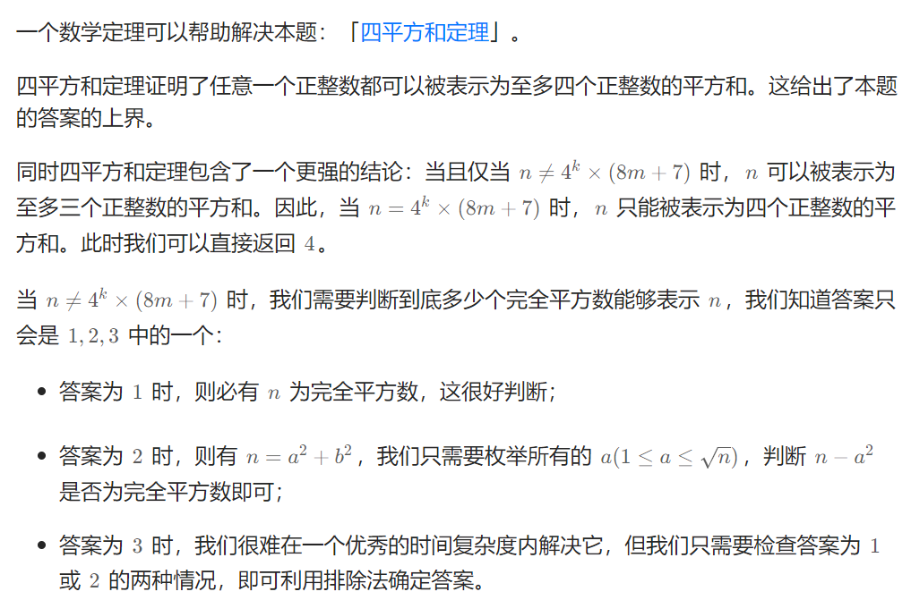
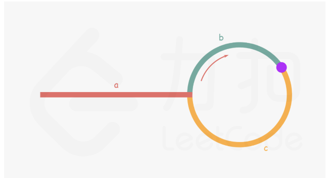

## 1、面试题

### 1.1 百度-排序数目

小红拿到了一个排列，她想知道有多少区间满足，区间内部的数构成一个排列?    

排列的定义:1到k，每个数都出现过且恰好出现一次，被称为一个长度为k的排列。例如[2,1,3][4,3,2,1]都是排列。

输入描述:有多组数据，首先输入一个正整数T，表示有T组数据 (1<=T<=2)每组数据的第一行输入一个正整数n，代表排列的大小 (1<=n<=2*10e5)每组数据的第二行输入n个正整数。

```java
输入示例
2
5
1 2 3 4 5
5
2 1 5 3 4
输出示例
5
3
说明
第一组数据[1],[1,2],[1,2,3],[1,2,3,4],[1,2,3,4,5]共5个排列。
第二组数据[2,1],[1],[2,1,5,3,4]共3个排列
```

思路：找出1的下标 然后往后遍历 找到2,3,4......的下标 依次记录最小下标值和最大下标值 计算长度 是否等于 当前最大数和最小数

```java
public static void main(String[] args) {
    Scanner input=new Scanner(System.in);
    int T=input.nextInt();
    int res[]=new int[T];
    for (int i = 0; i <T; i++) {
        int ans=1;
        int n=input.nextInt();
        //记录要输入的数字
        int numbers[]=new int[n];
        //记录这些数字的下标值 index[1] 记录的为 numbers值为1的下标
        int index[]=new int[n+1];
        for (int j = 0; j < n; j++) {
            numbers[j]=input.nextInt();
            index[numbers[j]]=j;
        }
        int left=index[1],right=index[1];
        // 依次往后找2，3，4.。。不断更新最小下标和最大下标 有相同的就加加
        for (int j = 2; j <= n; j++) {
            left=Math.min(left,index[j]);
            right=Math.max(right,index[j]);
            if(right-left==j-1){
                ans++;
            }
        }
        res[i]=ans;
    }
    for (int i = 0; i < res.length; i++) {
        System.out.println(res[i]);
    }
}
```

## 2、思路类题

### 2.1 力扣581. 最短无序连续子数组

给你一个整数数组 `nums` ，你需要找出一个 **连续子数组** ，如果对这个子数组进行升序排序，那么整个数组都会变为升序排序。请你找出符合题意的 **最短** 子数组，并输出它的长度。

```
输入：nums = [2,6,4,8,10,9,15]
输出：5
解释：你只需要对 [6, 4, 8, 10, 9] 进行升序排序，那么整个表都会变为升序排序。
```

思路：数组分为三个部分 numsA numsB numsC 其中numsA中最大元素小于 numsB和C numsC中最小元素大于numsA和B 从左往右找最大元素，若当前元素大于最大之前最大元素则更新 最大元素，若小于则更新下标（当前元素为不满足numsC的定义(numsC有序），可能为numsB的右边界）遍历完及找到numsB左边界 同理找最小及为左边界

```java
class Solution {
    public int findUnsortedSubarray(int[] nums) {
        int n = nums.length;
        int maxn = Integer.MIN_VALUE, right = -1;
        int minn = Integer.MAX_VALUE, left = -1;
        for (int i = 0; i < n; i++) {
            if (maxn > nums[i]) { //maxn:表示前一项;nums[i]:表示当前项
                right = i;//可理解为:前一项比当前项大时,该数组不为升序数组,并记录当前项.  遍历一次后,right即为最后一个使之不为升序数组的数.  left同理
            } else {
                maxn = nums[i];
            }
            if (minn < nums[n - i - 1]) {
                left = n - i - 1;
            } else {
                minn = nums[n - i - 1];
            }
        }
        return right == -1 ? 0 : right - left + 1;
    }
}
```

### 2.2 四平方和定理：



```java
//力扣 279完全平方数，自己使用的动态规划
class Solution {
    public int numSquares(int n) {
        if (isPerfectSquare(n)) {
            return 1;
        }
        if (checkAnswer4(n)) {
            return 4;
        }
        for (int i = 1; i * i <= n; i++) {
            int j = n - i * i;
            if (isPerfectSquare(j)) {
                return 2;
            }
        }
        return 3;
    }

    // 判断是否为完全平方数
    public boolean isPerfectSquare(int x) {
        int y = (int) Math.sqrt(x);
        return y * y == x;
    }

    // 判断是否能表示为 4^k*(8m+7)
    public boolean checkAnswer4(int x) {
        while (x % 4 == 0) {
            x /= 4;
        }
        return x % 8 == 7;
    }
}
```


### 2.3 力扣448. 找到所有数组中消失的数字

给你一个含 `n` 个整数的数组 `nums` ，其中 `nums[i]` 在区间 `[1, n]` 内。请你找出所有在 `[1, n]` 范围内但没有出现在 `nums` 中的数字，并以数组的形式返回结果。(你能在不使用额外空间且时间复杂度为 `O(n)` 的情况下解决这个问题吗? 你可以假定返回的数组不算在额外空间内。)

**示例 1：**

```
输入：nums = [4,3,2,7,8,2,3,1]
输出：[5,6]
```

**示例 2：**

```
输入：nums = [1,1]
输出：[2]
```

思路：正常来说 需要一个hash来表示当前数字是否出现过，当前题目可以考虑用原nums 来表示 是否出现过，可以将nums[x-1]+n 来表示是否出现过，因为nums[i] 在1-n范围内  则x-1不会越界，+n 则肯定大于n 若大于n表示当前数字已经出现过，有可能后面下标 已经+n 因此需要%n 变回原来数字 

```java
class Solution {
    public List<Integer> findDisappearedNumbers(int[] nums) {
        int n = nums.length;
        for (int num : nums) {
            int x = (num - 1) % n;
            nums[x] += n;
        }
        List<Integer> ret = new ArrayList<Integer>();
        for (int i = 0; i < n; i++) {
            if (nums[i] <= n) {
                ret.add(i + 1);
            }
        }
        return ret;
    }
}
```

### 2.4 力扣287. 寻找重复数

给定一个包含 `n + 1` 个整数的数组 `nums` ，其数字都在 `[1, n]` 范围内（包括 `1` 和 `n`），可知至少存在一个重复的整数。

假设 `nums` 只有 **一个重复的整数** ，返回 **这个重复的数** 。

你设计的解决方案必须 **不修改** 数组 `nums` 且只用常量级 `O(1)` 的额外空间。

**示例 1：**

```
输入：nums = [1,3,4,2,2]
输出：2
```

**示例 2：**

```
输入：nums = [3,1,3,4,2]
输出：3
```

**提示：**

- `1 <= n <= 105`
- `nums.length == n + 1`
- `1 <= nums[i] <= n`
- `nums` 中 **只有一个整数** 出现 **两次或多次** ，其余整数均只出现 **一次**

**进阶：**

- 如何证明 `nums` 中至少存在一个重复的数字?
- 你可以设计一个线性级时间复杂度 `O(n)` 的解决方案吗？

思路：

方法1：二分查找 中间值 计算数组中大于这个中间值的个数，然后循环二分 

方法2：利用位运算 计算出每一位的个数 然后得出每一位

方法3：利用快慢指针，将该数组当成循环链表计算

```java
//方法1
class Solution {
    public int findDuplicate(int[] nums) {
        int n = nums.length;
        int l = 1, r = n - 1, ans = -1;
        while (l <= r) {
            int mid = (l + r) >> 1;
            int cnt = 0;
            for (int i = 0; i < n; ++i) {
                if (nums[i] <= mid) {
                    cnt++;
                }
            }
            if (cnt <= mid) {
                l = mid + 1;
            } else {
                r = mid - 1;
                ans = mid;
            }
        }
        return ans;
    }
}
//方法2
class Solution {
    public int findDuplicate(int[] nums) {
        int n = nums.length, ans = 0;
        int bit_max = 31;
        while (((n - 1) >> bit_max) == 0) {
            bit_max -= 1;
        }
        for (int bit = 0; bit <= bit_max; ++bit) {
            int x = 0, y = 0;
            for (int i = 0; i < n; ++i) {
                if ((nums[i] & (1 << bit)) != 0) {
                    x += 1;
                }
                if (i >= 1 && ((i & (1 << bit)) != 0)) {
                    y += 1;
                }
            }
            if (x > y) {
                ans |= 1 << bit;
            }
        }
        return ans;
    }
}
方法3
class Solution {
    public int findDuplicate(int[] nums) {
        int slow = 0, fast = 0;
        do {
            slow = nums[slow];
            fast = nums[nums[fast]];
        } while (slow != fast);
        slow = 0;
        while (slow != fast) {
            slow = nums[slow];
            fast = nums[fast];
        }
        return slow;
    }
}
```


## 3、排序

### 3.1 力扣215. 数组中的第K个最大元素

给定整数数组 `nums` 和整数 `k`，请返回数组中第 `k` 个最大的元素。请注意，你需要找的是数组排序后的第 `k` 个最大的元素，而不是第 `k` 个不同的元素。你必须设计并实现时间复杂度为 `O(n)` 的算法解决此问题。

**示例 1:**

```
输入: [3,2,1,5,6,4], k = 2
输出: 5
```

**示例 2:**

```
输入: [3,2,3,1,2,4,5,5,6], k = 4
输出: 4
```

**提示：**

- `1 <= k <= nums.length <= 105`
- `-104 <= nums[i] <= 104`

思路：利用快速排序，每次快速排序能得到一个数的最后位置，用这个位置进行比较看是否是第K大若不是，则从前后进行找，可利用随机数 每次随机选择一个数看是否为最终数据

```java
class Solution {
    Random random=new Random();
    public int findKthLargest(int[] nums, int k) {
        return quickSelect(nums,k,0,nums.length-1);
    }
    //快速排序返回第k大数
    public int quickSelect(int []nums,int k,int left,int right){
        //随机找一个默认为最终求解结果
        int index=random.nextInt(0,right-left+1)+left;
        //快排后 当前下标数据覆盖掉
        int target=nums[index];
        nums[index]=nums[left];
        int i=left,j=right;
        // 快速排序
        while(i<j){
            while(i<j&&target>=nums[j]){
                j--;
            }
            nums[i]=nums[j];
            while(i<j&&target<=nums[i]){
                i++;
            }
            nums[j]=nums[i];
        }
        nums[i]=target;
        //判断当前数字是否是第k大元素
        if(i==k-1){
            return target;
        }else if(i<k){
            return quickSelect(nums,k,i+1,right);
        }else{
            return quickSelect(nums,k,left,i-1);
        }
    }
}
```


## 4、链表

### 4.1 环形链表求环入口

链表是否有环：

（1）如果链表无环，则快慢指针不会相遇，快指针一定会走到链表的尾部，也就是next指针为null的地方。

（2）如果链表有环，则快慢指针一定会相遇，证明如下：

          当快慢指针都位于环内时，环是不存在先后之分的，我们可以将快慢指针的相遇，当成快指针追赶慢指针的过程，然后用数据归纳法分情况讨论：
    *1）如果快指针位于慢指针后面1位，则下一次走时，慢指针往前走1位，快指针往前走2位，快慢指针相遇。
    *2）如果快指针位于慢指针后面2位，则下一次走时，慢指针往前走1位，快指针往前走2位，变成*1）的情况。
    *3）如果快指针位于慢指针后面n位，则下一次走时，慢指针往前走1位，快指针往前走2位，快指针位于慢指针后面n-1位。
    也就是说，n次后，快慢指针终究会相遇。因为是在环里，快慢指针的距离，一定是小于环的大小的。所以慢指针不用走1圈，就能和快指针相遇。

寻找环的入口：



 如上图所示：

    a :  从链表头节点到链表环入口的距离
    b：从链表环入口顺时针到快慢指针第一次相遇的距离
    c： 从快慢指针第一次相遇的位置，顺时针到链表入环点的距离

第一次相遇时，设快指针此时绕环走了N圈，快指针走过的距离是慢指针的2倍：

```
// 快指针走的距离是慢指针的2倍
2(a + b) = a + N * ( b + c ) + b
//上式可以转化为
a = ( N - 1 ) * ( b + c ) + c

a = ( N - 1 ) * ( b + c ) + c，可以理解为：从相遇点到入环点的距离，加上(N-1)圈的环长，刚好等于从链表头部到入环点的距离。
因此，当快慢指针相遇时，我们将快指针指向链表头部，并且改为和慢指针一样，每次走一步，最终它们会在入环扣相遇。
```

```java
public class Solution {
    public ListNode detectCycle(ListNode head) {
        if(head==null){
            return null;
        }
        ListNode firstNode=head;
        ListNode secondNode=head;
        do{
            if(secondNode.next==null||secondNode.next.next==null){
                return null;
            }
            secondNode=secondNode.next.next;
            firstNode=firstNode.next;
        }while(firstNode!=secondNode);
        secondNode=head;
        while(firstNode!=secondNode){
            secondNode=secondNode.next;
            firstNode=firstNode.next;
        }
        return firstNode;
    }
}
```


## 5、动态规划

### 5.1 力扣 426 目标和

给你一个整数数组 `nums` 和一个整数 `target` 。

向数组中的每个整数前添加 `'+'` 或 `'-'` ，然后串联起所有整数，可以构造一个 **表达式** ：

- 例如，`nums = [2, 1]` ，可以在 `2` 之前添加 `'+'` ，在 `1` 之前添加 `'-'` ，然后串联起来得到表达式 `"+2-1"` 。

返回可以通过上述方法构造的、运算结果等于 `target` 的不同 **表达式** 的数目。

```
输入：nums = [1,1,1,1,1], target = 3
输出：5
解释：一共有 5 种方法让最终目标和为 3 。
-1 + 1 + 1 + 1 + 1 = 3
+1 - 1 + 1 + 1 + 1 = 3
+1 + 1 - 1 + 1 + 1 = 3
+1 + 1 + 1 - 1 + 1 = 3
+1 + 1 + 1 + 1 - 1 = 3

1 <= nums.length <= 20
0 <= nums[i] <= 1000
0 <= sum(nums[i]) <= 1000
-1000 <= target <= 1000
```

思想：设添加－号的数字和为neg ，则有sum-neg=target+neg 即 neg=(sum-target)/2。因为所有的数字均为整数且大于0 则 sum-target 为负 或者不为2的倍数 则返回0。该题即求所有前n个数和为neg的数量，设动态转移方程dp[i] [j] 为前i个数和为j1的个数

则dp[i] [j]=(dp[i-1] [j]   nums[i]>j)

   dp[i] [j]= (dp[i-1] [j-nums[i]]+dp[i-1] [j]  j>=nums[i])

优化 使用循环数组(从大往小，防止修改底层数据)

```java
class Solution {
    public int findTargetSumWays(int[] nums, int target) {
         int sum = 0;
        for (int num : nums) {
            sum += num;
        }
        int diff = sum - target;
        if (diff < 0 || diff % 2 != 0) {
            return 0;
        }
        int neg = diff / 2;
        int[] dp = new int[neg + 1];
        dp[0] = 1;
        for (int num : nums) {
            for (int j = neg; j >= num; j--) {
                dp[j] += dp[j - num];
            }
        }
        return dp[neg];

    }
}
```

### 5.2 力扣 416. 分割等和子集

给你一个 **只包含正整数** 的 **非空** 数组 `nums` 。请你判断是否可以将这个数组分割成两个子集，使得两个子集的元素和相等。

**示例 1：**

```
输入：nums = [1,5,11,5]
输出：true
解释：数组可以分割成 [1, 5, 5] 和 [11] 。
```

**示例 2：**

```
输入：nums = [1,2,3,5]
输出：false
解释：数组不能分割成两个元素和相等的子集。
```

```java
//dp原始方法 未优化空间复杂度 
class Solution {
    public boolean canPartition(int[] nums) {
        int n = nums.length;
        if (n < 2) {
            return false;
        }
        int sum = 0, maxNum = 0;
        for (int num : nums) {
            sum += num;
            maxNum = Math.max(maxNum, num);
        }
        if (sum % 2 != 0) {
            return false;
        }
        int target = sum / 2;
        if (maxNum > target) {
            return false;
        }
        boolean[][] dp = new boolean[n][target + 1];
        for (int i = 0; i < n; i++) {
            dp[i][0] = true;
        }
        dp[0][nums[0]] = true;
        for (int i = 1; i < n; i++) {
            int num = nums[i];
            for (int j = 1; j <= target; j++) {
                if (j >= num) {
                    dp[i][j] = dp[i - 1][j] | dp[i - 1][j - num];
                } else {
                    dp[i][j] = dp[i - 1][j];
                }
            }
        }
        return dp[n - 1][target];
    }
}

//dp原始方法 优化空间复杂度 
class Solution {
    public boolean canPartition(int[] nums) {
        int n = nums.length;
        if (n < 2) {
            return false;
        }
        int sum = 0, maxNum = 0;
        for (int num : nums) {
            sum += num;
            maxNum = Math.max(maxNum, num);
        }
        if (sum % 2 != 0) {
            return false;
        }
        int target = sum / 2;
        if (maxNum > target) {
            return false;
        }
        boolean[] dp = new boolean[target + 1];
        dp[0] = true;
        for (int i = 0; i < n; i++) {
            int num = nums[i];
            for (int j = target; j >= num; --j) {
                dp[j] |= dp[j - num];
            }
        }
        return dp[target];
    }
}
```


## 6、贪心算法

### 6.1 力扣 621任务调度器

给你一个用字符数组 `tasks` 表示的 CPU 需要执行的任务列表。其中每个字母表示一种不同种类的任务。任务可以以任意顺序执行，并且每个任务都可以在 1 个单位时间内执行完。在任何一个单位时间，CPU 可以完成一个任务，或者处于待命状态。

然而，两个 **相同种类** 的任务之间必须有长度为整数 `n` 的冷却时间，因此至少有连续 `n` 个单位时间内 CPU 在执行不同的任务，或者在待命状态。

你需要计算完成所有任务所需要的 **最短时间** 。

```
输入：tasks = ["A","A","A","B","B","B"], n = 2
输出：8
解释：A -> B -> (待命) -> A -> B -> (待命) -> A -> B
     在本示例中，两个相同类型任务之间必须间隔长度为 n = 2 的冷却时间，而执行一个任务只需要一个单位时间，所以中间出现了（待命）状态。 
输入：tasks = ["A","A","A","B","B","B"], n = 0

输出：6
解释：在这种情况下，任何大小为 6 的排列都可以满足要求，因为 n = 0
["A","A","A","B","B","B"]
["A","B","A","B","A","B"]
["B","B","B","A","A","A"]
...
诸如此类
```

```java
思想：先找出出现频次最大的 然后往里面加空 若存在一样长的直接往里面加 若小于则添加空 最后比较总字符串长度和 满足最长字符串需要空即可
class Solution {
     public int leastInterval(char[] tasks, int n) {
        //统计每个任务出现的次数，找到出现次数最多的任务
        int[] hash = new int[26];
        for(int i = 0; i < tasks.length; ++i) {
            hash[tasks[i] - 'A'] += 1;
        }
        Arrays.sort(hash);
        //因为相同元素必须有n个冷却时间，假设A出现3次，n = 2，任务要执行完，至少形成AXX AXX A序列（X看作预占位置）
        //该序列长度为
        int minLen = (n+1) *  (hash[25] - 1) + 1;

        //此时为了尽量利用X所预占的空间（贪心）使得整个执行序列长度尽量小，将剩余任务往X预占的空间插入
        //剩余的任务次数有两种情况：
        //1.与A出现次数相同，比如B任务最优插入结果是ABX ABX AB，中间还剩两个空位，当前序列长度+1
        //2.比A出现次数少，若还有X，则按序插入X位置，比如C出现两次，形成ABC ABC AB的序列
        //直到X预占位置还没插满，剩余元素逐个放入X位置就满足冷却时间至少为n
        for(int i = 24; i >= 0; --i){
            if(hash[i] == hash[25]) ++ minLen;
        }
        //当所有X预占的位置插满了怎么办？
        //在任意插满区间（这里是ABC）后面按序插入剩余元素，比如ABCD ABCD发现D之间距离至少为n+1，肯定满足冷却条件
        //因此，当X预占位置能插满时，最短序列长度就是task.length，不能插满则取最少预占序列长度
        return Math.max(minLen, tasks.length);
    }
}
```

## 7、单调最大值队列 单独最大值栈

### 7.1 力扣239. 滑动窗口最大值

给你一个整数数组 `nums`，有一个大小为 `k` 的滑动窗口从数组的最左侧移动到数组的最右侧。你只可以看到在滑动窗口内的 `k` 个数字。滑动窗口每次只向右移动一位。返回 *滑动窗口中的最大值* 。

**示例 1：**

```
输入：nums = [1,3,-1,-3,5,3,6,7], k = 3
输出：[3,3,5,5,6,7]
解释：
滑动窗口的位置                最大值
---------------               -----
[1  3  -1] -3  5  3  6  7       3
 1 [3  -1  -3] 5  3  6  7       3
 1  3 [-1  -3  5] 3  6  7       5
 1  3  -1 [-3  5  3] 6  7       5
 1  3  -1  -3 [5  3  6] 7       6
 1  3  -1  -3  5 [3  6  7]      7
```

**示例 2：**

```
输入：nums = [1], k = 1
输出：[1]
```

思路：单调最大值队列，采用双向队列 

入队列：若空直接进队列 若非空 则从尾入 比当前小的出 直到找到比当前值大的。

出队列：若和队列头相同则出，否则不出。

原理：若 进队列 1 1 1 1 2 则前面1对最大值无影响。当滑动窗口向右移动时，只要 nums[i] 还在窗口中，那么 nums[j] 一定也还在窗口中，这是 i 在 j 的左侧所保证的。因此，由于 nums[j] 的存在，nums[i] 一定不会是滑动窗口中的最大值了，我们可以将 nums[i]永久地移除。

```java
class Solution {
    public int[] maxSlidingWindow(int[] nums, int k) {
        Deque<Integer>queue=new LinkedList<>();
        int n=nums.length;
        int []ans=new int[n+1-k];
        for(int i=0;i<n;i++){
            if(queue.isEmpty()||nums[i]>queue.peekFirst()){
                queue.clear();
                queue.add(nums[i]);
            }else{
                while(queue.peekLast()<nums[i]){
                    queue.pollLast();
                }
                queue.add(nums[i]);
            }
            if(i>=k-1){
                ans[i-k+1]=queue.peekFirst();
                if(nums[i-k+1]==queue.peekFirst()){
                    queue.pollFirst();
                }
            }
        }
        return ans;
    }
}
```

## 8、树

### 8.1 力扣236. 二叉树的最近公共祖先

给定一个二叉树, 找到该树中两个指定节点的最近公共祖先。[百度百科](https://baike.baidu.com/item/最近公共祖先/8918834?fr=aladdin)中最近公共祖先的定义为：“对于有根树 T 的两个节点 p、q，最近公共祖先表示为一个节点 x，满足 x 是 p、q 的祖先且 x 的深度尽可能大（**一个节点也可以是它自己的祖先**）。”

**示例 1：**

```
输入：root = [3,5,1,6,2,0,8,null,null,7,4], p = 5, q = 1
输出：3
解释：节点 5 和节点 1 的最近公共祖先是节点 3 。
```

**示例 2：**

```
输入：root = [3,5,1,6,2,0,8,null,null,7,4], p = 5, q = 4
输出：5
解释：节点 5 和节点 4 的最近公共祖先是节点 5 。因为根据定义最近公共祖先节点可以为节点本身。
```

思路：方法1：若当前节点root 为所求最近公共祖先，则肯定有特征之一

1.左子树有一个节点并且右子树有一个节点

2.当前节点为其中一个节点 左子树有一个节点 或者右子树有一个节点

方法2：将树线索化，存储每个节点的父亲节点 然后根据其中一个节点找父亲并标记，从另外一个节点 进行找父亲节点 若遇到第一个标记则为最近公共祖先

```java
//方法1：
class Solution {
    private TreeNode ans;
    public Solution() {
        this.ans = null;
    }
    private boolean dfs(TreeNode root, TreeNode p, TreeNode q) {
        if (root == null) return false;
        boolean lson = dfs(root.left, p, q);
        boolean rson = dfs(root.right, p, q);
        if ((lson && rson) || ((root.val == p.val || root.val == q.val) && (lson || rson))) {
            ans = root;
        } 
        return lson || rson || (root.val == p.val || root.val == q.val);
    }

    public TreeNode lowestCommonAncestor(TreeNode root, TreeNode p, TreeNode q) {
        this.dfs(root, p, q);
        return this.ans;
    }
}

//方法2：
class Solution {
    Map<Integer, TreeNode> parent = new HashMap<Integer, TreeNode>();
    Set<Integer> visited = new HashSet<Integer>();
    public void dfs(TreeNode root) {
        if (root.left != null) {
            parent.put(root.left.val, root);
            dfs(root.left);
        }
        if (root.right != null) {
            parent.put(root.right.val, root);
            dfs(root.right);
        }
    }
    public TreeNode lowestCommonAncestor(TreeNode root, TreeNode p, TreeNode q) {
        dfs(root);
        while (p != null) {
            visited.add(p.val);
            p = parent.get(p.val);
        }
        while (q != null) {
            if (visited.contains(q.val)) {
                return q;
            }
            q = parent.get(q.val);
        }
        return null;
    }
}
```

