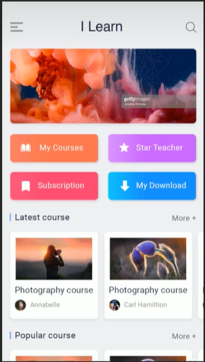

# Day3.22

##### 1.手机像素

---在不同的屏幕，单位像素大小不同，像素越小屏幕越清晰

---24寸，1920x1080

---智能手机的像素点，远远小于计算机的像素点

---一个宽度为900px的网页在iphone6中如何显示

​		默认情况下移动端的网页都会将视口设置为980像素（css像素），以确保pc端网页在移动端能正常显示，但是网页宽度超过980，移动端的浏览器会自动对网页进行缩放以完整显示网页

---基本上大部分pc端网站都可以在移动端中正常浏览，但不会有一个好的体验

​			为了解决这个问题，大部分网站会对移动端专门设置一个网站

##### 2.完美视口

---移动端默认视口大小是980px（css像素），默认情况下，移动端的像素比是980/移动端宽度

---如果直接在网页中编写移动端代码，这样在980的视口下，效果非常不好，网页中内容会变小

---在编写移动端页面时，确保有个合理的像素比

---我们可以通过调整视口大小来使移动端网页正常显示

​		meta标签

---每一款移动设备设计时，都会有一个最佳像素比，一般我们只需要设置像素比为该值就可以得到一个最佳效果

​		就叫做完美视口

meta name：“viewport” content：width=“device-width”  表示完美视口

# Day3.23

##### 1.vw单位

---vw表示的是视口的宽度

---100vw表示一个视口的大小

---设计图宽度750px 或1125px

​			使用vw作为单位 100vw

​			创建一个48x35 大小的元素

​			6.4vw=48px   4.667vw=36px

##### 2.vw适配

---网页中字体大小最小是12px，如果设置的比他还小，会自动设置为12px

```
html{
font-size:5.33333vw;
此时1rem=1 html的字体大小
		1rem= 40px
		0.133333333vm=1px
}
```

##### 3.爱学习项目练习




##### 4.媒体查询

---响应式布局

​		网页可以根据不同的设备或不同网页大小呈现出不同的效果

​		使用响应式布局，可以使一个网页适用于所有设备

---响应式布局的关键就是媒体查询

​		通过媒体查询，可以为不同的设备，或设备不同状态分别设置样式

---使用媒体查询

​			语法：@media 查询规则（）

​						媒体类型：

​									all 所有设备

​									print 打印设备

​									screen 带屏幕的设备

​										speech 屏幕阅读器

​						可以使用都好连接多个媒体类型，就是或的关系

​				可以在媒体类型前添加一个only，表示只有

​								主要用来兼容一些老版本浏览器

---媒体特性：

​				width 视口的高度

​				height 视口的高度

@media （min-width：500px）{

body{

background-color：#bfa}；视口宽度大于500px时背景颜色为#bfa

}

----min-width 最小宽度

​	max-width 最大宽度

----样式切换的分界点，称为断电，也就是网页的而央视会在这个点发生变化

​		小于768 超小屏幕    

​		大于768 小屏幕

​		大于992 中型屏幕

​		大于1200 大屏幕

屏幕大小在一个范围之间用and连接

##### 5.美图手机项目练习


