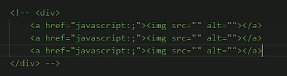

# Day3.5

##### 1.浏览器的默认样式

默认样式：通常情况下，浏览器都会为元素设置一些默认样式

​				默认样式会影响页面布局

​				通常情况下编写网页必须去掉浏览器的默认样式

list-style: none; 去除列表的小圆点

2.练习1：图片列表

方法1：

方法2：

练习2：京东左侧导航

练习3：网易新闻列表

font-weight ： bold ； 字体加粗

height: 25px;line-height: 25px;    使文字居中


3.盒子的大小

```
默认情况下：盒子可见框的大小由内容区，内边距和边框共同决定
		box-sizing 用来设置盒子尺寸的计算方式
		可选值：content-box 默认值，宽度和高度用来设置内容的大小
				border-box 宽度和高度用来设置盒子可见框的大小
					width和height指的是内容区和内边距和边框的总大小
					
```

4.轮廓阴影和圆角

```
<style>
        div{
            width: 100px;
            height: 100px;
            background-color: #bfa;
            /* outline 用来设置元素的轮廓线，用法和border一样
            二者不同：轮廓线不会影响可见框的大小 */
            
            /* box-shadow 设置元素阴影效果，不会影响布局
            第一个值：水平偏移量 正负
            第二个值：垂直偏移量 正负
            第三个值：虚化半径
            第四个值：阴影颜色 */
            box-shadow: 5px 5px 10px rgba(0, 0, 0,.3);
            /* border-radius 设置圆角半径大小
            border-top-left-radius
            border-top-right-radius
            border-bottom-left-radius
            border-bottom-right-radius*/
            /* border-top-left-radius: 50px 50px; */
            /* border-radius 可以分别指定四个角圆角
            四个值：
            三个值：
            两个值：自己试一试
            */
            border-radius: 10px 20px 30px ;
            /* 将元素设置成一个圆形 */
            border-radius:50%;
        }
        /* div:hover{
 outline: 10px red solid;
 border:10px red solid;
        }  */
    </style>
    
    <div></div>
```

5.浮动

```
 <style>
        .c1{
            width: 100px;
            height: 100px;
            background-color: #bfa;
 /* 通过浮动可以是一个元素想其父元素的左侧或右侧移动
            使用 float 设置元素浮动 只能设置方向不能设置浮动的距离
            可选值：none right left
            注意：元素设置浮动后，水平布局的等式就不需要强制成立了
            元素设置浮动后，会完全从文档脱离，不占用文档的位置
            所以元素下边的还在文档流中的元素会自动向上浮动
            浮动的特点：
            1.浮动元素会完全脱离文档流，不占用文档流的位置
            2.设置浮动以后元素会同父元素的左侧或右侧移动
            3.浮动元素默认不会从父元素移出
            4.浮动元素向左或向右移动式，不会超过它前边的其他浮动元素
            5.如果浮动元素的上边是一个没有浮动效果的块元素，则浮动元素无法上移动
            6.浮动元素不会超过他上边的浮动的兄弟的元素，最多和它一样高 */
            float: left;
        }
       /* .c1:hover{
           
            float: right;
            box-shadow: 10px 10px 10px rgba(0, 0, 0, .2);
        } */
        .c2{
            width: 100px;
            height: 100px;
            background-color: rgb(109, 207, 84);
float: left;
        }
        .c3{
            width: 100px;
            height: 100px;
            background-color: rgb(36, 85, 24);
            float: left;

        }
    </style>
    
    <div class="c1"></div>
    <div class="c2"></div>
    <div class="c3"></div>
```


